时间序列数据分析101

**大纲**

1.概述

2.准备和处理时间序列数据

3.探索式分析(EDA)

4.基于统计学的时间序列分析方法

5.基于状态空间模型的时间序列分析方法

6.特征生成和特征选择

7.基于机器学习的时间序列分析方法

8.基于深度学习的时间序列分析方法

9.模型评估和性能考虑


### 1. 概述

随着工业界大规模时间序列数据（例如物联网，医疗数字化，智慧城市等领域）的出现和算力的提升，时间序列数据分析的重要性日益凸显。因此伴随着大量时间序列数据被检测和收集，对于基于统计学和机器学习的具有竞争力的分析方法的需求也越来越强。因此在之后的章节中，我们将对时间序列数据分析进行一个全面的探讨。

首先来看时间序列分析的定义：

> 时间序列分析是指从按时间排序的数据点中抽取有价值的总结和统计信息的行为

时间序列分析既包含了对过去数据的诊断，也包括对未来数据的预测。

在最开始，时间序列分析并不是作为一个独立的学科而存在的，而是作为某些学科领域分析方法的一部分，因此有许多领域都对时间序列技术的发展起到了重要贡献。比较典型的例子包括：

- 医学
- 天气
- 经济学
- 天文学

一直到20世纪20年代，时间序列分析才正式脱离于其他学科独立发展，当时的一个标志是自回归模型的应用，这也奠定了基于统计学的时间序列分析的开端。

而基于机器学习的时间序列分析则最早开始于1969年，集成方法被应用于时间序列数据上，到了80年代更多应用场景涌现出来，如异常检测，动态时间规整，循环神经网络等。


### 2.准备和处理时间序列数据

#### 2.1 准备数据集

要进行数据分析之前，首先要准备好时间序列数据集。数据集可以通过两种方式获取：

- 在开源数据仓库中寻找现成数据
- 从非显式数据中构造时间特征，创造时间序列数据

列举几个常用的开源数据仓库,

[UCI Machine Learning Repository](https://archive.ics.uci.edu/ml/index.php)：包含约80个时间序列数据集，从意大利城市小时级空气质量，到糖尿病患者的活动饮食记录等各种各样的数据集。

[UEA and UCR Time Series Classification Repository](http://www.timeseriesclassification.com/index.php)：一个更高质量的时间序列数据集网站。

#### 2.2 寻找时间轴

时间序列在我们身边是广泛存在的，但有时候在数据存储时并没有一列显式存在的时间列，这时候就需要我们去人为寻找和构造。以下是一些不同的时间列存在形式的例子：

- 以事件记录的时间构造时间列
- 以另一个和时间相关的元素构造时间列，例如在一个数据集中行驶距离和时间是正相关的，此时就可以以距离来构造时间列
- 以物理轨迹的顺序作为时间列，例如在医学，天气等领域有些数据是以图片的形式存储的，此时可以从图像中提取时间列

#### 2.3 时间序列可能遇到的问题

在时间序列数据分析中，时间戳是一个十分重要的特征，它能帮我们有效理解数据。

第一个我们会遇到的问题是时间值是在哪个过程产生的，以及何时产生的。通常事件发生的时间和事件被记录的时间往往是不一致的。例如一个研究员先在笔记本上以手写的方式记录，然后在结束研究后再统一以csv的格式录入数据库。那么此时时间戳究竟表示的是手动记录的时间还是录入数据库的时间。

因此在我们看到一个新的时间特征时，总是应当首先确认这个事件时间是如何产生的。作为一个数据分析师，我们应当时刻有这样一种意识，理解数据，理解时间戳的产生过程是我们的责任，只有充分理解了这些，我们才能更好地和其他同事沟通，用数据为业务赋能。

第二个我们会遇到的问题如果我们在处理历史遗留数据，并没有清洗记录的文档说明，也无法找到处理数据流的人来确认时间戳产生的方式。这时需要我们做一些经验上的调查和推断。

有一些通用的方法能帮助我们理解时间特征：1）通过比较不同类别特征（如不同用户）的数据来理解某些时间模式（pattern）是否是共同的。2）使用聚合数据分析来理解时间特征，如该时间戳是本地时间时区还是标准时间时区，该时间反应的是用户行为还是一些外部限制（网络通信）。

第三个值得探讨的问题是什么是一个有意义的时间尺度。当我们拿到一组时间序列数据时，要思考该选择怎么样的时间分辨率，这对于后续特征构造和模型有效性都有很大的影响。通常这取决于你所研究对象的领域知识，以及数据如何被收集的细节。举个例子，假设你正在查看每日销售数据，但如果你了解销售经理的行为就会知道在许多时候他们会等到每周末才报告数字，他们会粗略估计每天的数字，而不是每天记录它们，因为由于退货的存在，每天的数值常常存在系统偏差。所以你可能会考虑将销售数据的分辨率从每天更改为每周以减少这个系统误差。

#### 2.4 清洗数据

数据清洗是数据分析的一个重要环节，对于时间序列数据也不例外，本节将详细介绍针对时间序列数据的数据清洗方法。

- 缺失值处理
- 改变时间频率
- 平滑数据

##### 2.4.1 缺失值处理

缺失值的出现很常见，例如在医疗场景中，一个时间序列数据出现缺失可能有以下原因：

- 病人没有遵从医嘱
- 病人的健康状态很好，因此没必要在每个时刻都记录
- 病人被忘记了
- 医疗设备出现随机性的技术故障
- 数据录入问题

最常用的处理缺失值的方法包括填补（imputation）和删除（deletion）两种。

Imputation:基于完整数据集的其他值填补缺失值

Deletion:直接删除有缺失值的时间段

一般来说，我们更倾向于保留数据而不是删掉，避免造成信息损失。在实际案例中，采取何种方式要考虑是否可以承受删除特定数据的损失。

本节将重点讨论三种数据填补方法，并用python演示如何使用：

- Forward fill
- Moving average
- Interpolation

用到的数据集是美国年度失业率数据，数据集来自[OECD官网](https://data.oecd.org/unemp/unemployment-rate-forecast.htm)。

**Forward fill**

前向填充法是用来填补数据最简单的方法之一，核心思想是用缺失值之前出现的最近一个时间点的数值来填补当前缺失值。使用这种方法不需要任何数学或复杂逻辑。

与前向填充相对应的，还有一种backward fill的方法，顾名思义，是指用缺失值之后出现的最近一个时间点的数值来填充。但是使用这种方法需要特别谨慎，因为这种方法是一种lookahead行为，只有当你不需要预测未来数据的时候才能考虑使用。

总结前向填充法的优点，计算简单，很容易用于实时流媒体数据。


**Moving average**

移动平均法是填补数据的另一种方法，核心思想是取出缺失值发生之前的一段滚动时间内的值，计算其平均值或中位数来填补缺失。在有些场景下，这种方法会比前向填充效果更好，例如数据的噪声很大，对于单个数据点有很大的波动，但用移动平均的方法就可以弱化这些噪声。

同样的，你也可以使用缺失值发生之后的时间点计算均值，但需要注意lookahead问题。

另外一个小trick是，计算均值时可以根据实际情况采取多种方法，如指数加权，给最近的数据点赋予更高的权重。


**Interpolation**

插值是另一种确定缺失数据点值的方法，主要基于我们希望整体数据如何表现的各种图像上的约束。 例如，线性插值要求缺失数据和邻近点之间满足一定的线性拟合关系。因此插值法是一种先验方法，使用插值法时需要代入一些业务经验。

在许多情况下，线性（或样条）插值都是非常合适的。例如考虑平均每周温度，其中存在已知的上升或上升趋势，气温下降取决于一年中的时间。或者考虑一个已知年度销售数据
不断增长的业务。在这些场景下，使用插值法都能取得不错的效果。

当然也有很多情况不适合线性（或样条）插值的场景。例如在天气数据集中缺少降水数据，就不应在已知天数之间进行线性推断，因为降水的规律不是这样的。同样，如果我们查看某人每天的睡眠时间，我们也不应该利用已知天数的睡眠时间线性外推。


**Python代码实现**

```python
import pandas as pd
import numpy as np
import matplotlib.pyplot as plt
%matplotlib inline
pd.set_option('max_row',1000)
```


```python
# 导入美国年度失业率数据
unemploy = pd.read_csv('data\\unemployment.csv')
```


```python
unemploy.head()
```

<table border="1" class="dataframe">
  <thead>
    <tr style="text-align: right;">
      <th></th>
      <th>year</th>
      <th>rate</th>
    </tr>
  </thead>
  <tbody>
    <tr>
      <th>0</th>
      <td>1955</td>
      <td>4.383333</td>
    </tr>
    <tr>
      <th>1</th>
      <td>1956</td>
      <td>4.141667</td>
    </tr>
    <tr>
      <th>2</th>
      <td>1957</td>
      <td>4.258333</td>
    </tr>
    <tr>
      <th>3</th>
      <td>1958</td>
      <td>6.800000</td>
    </tr>
    <tr>
      <th>4</th>
      <td>1959</td>
      <td>5.475000</td>
    </tr>
  </tbody>
</table>


```python
# 构建一列随机缺失值列
unemploy['missing'] = unemploy['rate']
# 随机选择10%行手动填充缺失值
mis_index = unemploy.sample(frac=0.1,random_state=999).index
unemploy.loc[mis_index,'missing']=None
```

**1.使用 forward fill填补缺失值**


```python
unemploy['f_fill'] = unemploy['missing']
unemploy['f_fill'].ffill(inplace=True)
```


```python
# 观察填充效果
plt.scatter(unemploy.year,unemploy.rate,s=10)
plt.plot(unemploy.year,unemploy.rate,label='real')
plt.scatter(unemploy[~unemploy.index.isin(mis_index)].year,unemploy[~unemploy.index.isin(mis_index)].f_fill,s=10,c='r')
plt.scatter(unemploy.loc[mis_index].year,unemploy.loc[mis_index].f_fill,s=50,c='r',marker='v')
plt.plot(unemploy.year,unemploy.f_fill,label='forward fill')
plt.legend()
```
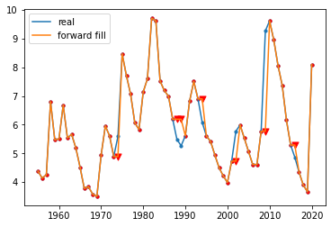


**2.使用moving average填补缺失值**


```python
unemploy['moveavg']=np.where(unemploy['missing'].isnull(),
                             unemploy['missing'].shift(1).rolling(3,min_periods=1).mean(),
                             unemploy['missing'])
```


```python
# 观察填充效果
plt.scatter(unemploy.year,unemploy.rate,s=10)
plt.plot(unemploy.year,unemploy.rate,label='real')
plt.scatter(unemploy[~unemploy.index.isin(mis_index)].year,unemploy[~unemploy.index.isin(mis_index)].f_fill,s=10,c='r')
plt.scatter(unemploy.loc[mis_index].year,unemploy.loc[mis_index].f_fill,s=50,c='r',marker='v')
plt.plot(unemploy.year,unemploy.f_fill,label='forward fill',c='r',linestyle = '--')
plt.scatter(unemploy[~unemploy.index.isin(mis_index)].year,unemploy[~unemploy.index.isin(mis_index)].moveavg,s=10,c='r')
plt.scatter(unemploy.loc[mis_index].year,unemploy.loc[mis_index].moveavg,s=50,c='g',marker='^')
plt.plot(unemploy.year,unemploy.moveavg,label='moving average',c='g',linestyle = '--')
plt.legend()
```


    


**3.使用interpolation填补缺失值**


```python
# 尝试线性插值和多项式插值
unemploy['inter_lin']=unemploy['missing'].interpolate(method='linear')
unemploy['inter_poly']=unemploy['missing'].interpolate(method='polynomial', order=3)
```


```python
# 观察填充效果
plt.plot(unemploy.year,unemploy.rate,label='real')
plt.plot(unemploy.year,unemploy.inter_lin,label='linear interpolation',c='r',linestyle = '--')
plt.plot(unemploy.year,unemploy.inter_poly,label='polynomial interpolation',c='g',linestyle = '--')
plt.legend()
```


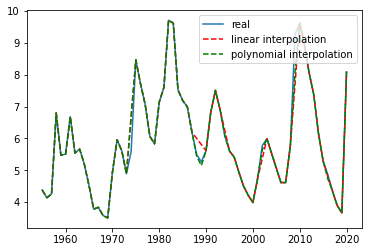
    

##### 2.4.2 改变数据集时间频率

通常我们会发现来自不同数据源的时间轴常常无法一一对应，此时就要用到改变时间频率的方法进行数据清洗。由于无法改变实际测量数据的频率，我们能做的是改变数据收集的频率，也就是本节提到的上采样（upsamping）和下采样（downsampling）。

**下采样**

下采样指的是减少数据收集的频率，也就是从原始数据中抽取子集的方式。

以下是一些下采样会用到的场景：

- 数据原始的分辨率不合理：例如有一个记录室外温度的数据，时间频率是每秒钟一次。我们都知道，气温不会在秒钟这个级别有明显的变化，而且秒级的气温数据的测量误差甚至会比数据本身的波动还要大，因此这个数据集有着大量的冗余。在这个案例中，每隔n个元素取一次数据可能更合理一些。

- 关注某个特定季节的信息：如果担心某些数据存在季节性的波动，我们可以只选择某一个季节（或月份）进行分析，例如只选择每年一月份的数据进行分析。
- 进行数据匹配：例如你有两个时间序列数据集，一个更低频（年度数据），一个更高频（月度数据），为了将两个数据集匹配进行下一步的分析，可以对高频数据进行合并操作，如计算年度均值或中位数，从而获得相同时间轴的数据集。

**上采样**

上采样在某种程度上是凭空获得更高频率数据的方式，我们要记住的是使用上采样，只是让我们获得了更多的数据标签，而没有增加额外的信息。

以下是一些上采样会用到的场景：

- 不规律的时间序列：用于处理多表关联中存在不规则时间轴的问题。

  例如现在有两个数据，一个记录了捐赠的时间和数量

  | amt  |    dt     |
  | :--: | :-------: |
  |  99  | 2019-2-27 |
  | 100  | 2019-3-2  |
  |  5   | 2019-6-13 |
  |  15  | 2019-8-1  |
  |  11  | 2019-8-31 |
  | 1200 | 2019-9-15 |

  另一个数据记录了公共活动的时间和代号

  | identifier |    dt    |
  | :--------: | :------: |
  |   q4q42    | 2019-1-1 |
  |   4299hj   | 2019-4-1 |
  |    bbg2    | 2019-7-1 |

  这时我们需要合并这两个表的数据，为每次捐赠打上标签，记录每次捐赠之前最近发生的一次公共活动，这种操作叫做rolling join，关联后的数据结果如下。

  | identifier |  dt  |    amt    |
  | :--------: | :--: | :-------: |
  |   q4q42    |  99 | 2019-2-27 |
  |   q4q42    | 100 | 2019-3-2  |
  |   4299hj   |  5  | 2019-6-13  |
  |    bbg2    | 15  | 2019-8-1    |
  |    bbg2    | 11  |2019-8-31    |
  |    bbg2    | 1200| 2019-9-15   |

- 进行数据匹配：类似下采样的场景，例如我们有一个月度的失业率数据，为了和其他数据匹配需要转换成日度的数据，如果我们假定新工作一般都是从每个月第一天开始的，那么可以推演认为这个月每天的失业率都等于该月的失业率。

通过以上的案例我们发现，即使是在十分干净的数据集中，由于需要比较来自不同维度的具有不同尺度的数据，也经常需要使用到上采样和下采样的方法。

##### 2.4.3 平滑数据

数据平滑也是一个常用的数据清洗的技巧，为了能讲述一个更能被理解的故事，在数据分析前常常会进行平滑处理。数据平滑通常是为了消除一些极端值或测量误差。即使有些极端值本身是真实的，但是并没有反应出潜在的数据模式，我们也会把它平滑掉。

在讲述数据平滑的概念时，需要引入下图层层递进。

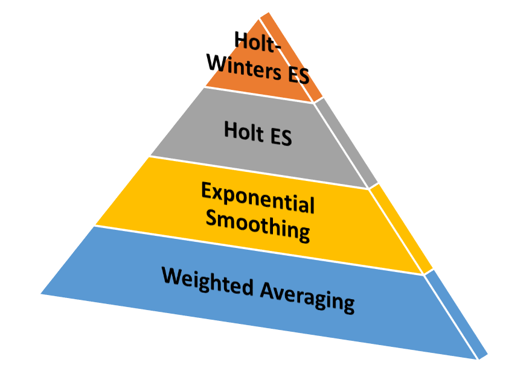

weighted averaging，也就是上文曾经讲过的moving average，也是一种最简单的平滑技术，即可以给予数据点相同的权重，也可以给越邻近的数据点更高的权重。

exponential smoothing，本质上和weighted averaging类似，都是给越邻近的数据点更高的权重，区别在于衰减的方式不同，指数平滑法顾名思义，从最邻近到最早的数据点的权重呈现指数型下降的规律，weighted averaging需要为每一个权重指定一个确定值。指数平滑法在很多场景下效果都很好，但它也有一个明显的缺点，无法适用于呈现趋势变化或季节性变化的数据。

t时刻的指数平滑后的值可以用以下公式表示，
$$
S_t = \alpha * x_{t} + (1 – \alpha) * S_{t-1}
$$
其中$St,S_{t-1}$表示当前时刻和上一个时刻的平滑值，$x_t$表示当前时刻的实际值，$\alpha$表示平滑系数，该系数越大则越近邻的数据影响越大。

Holt Exponential Smoothing，这种技术通过引入一个额外的系数，解决了指数平滑无法应用于具有趋势特点数据的不足，但但是依然无法解决具有季节性变化数据的平滑问题。

Holt-Winters Exponential Smoothing，这种技术通过再次引入一个新系数的方式同时解决了Holt Exponential Smoothing无法解决具有季节性变化数据的不足。简单来说，它是在指数平滑只有一个平滑系数的基础上，额外引入了趋势系数和季节系数来实现的。这种技术在时间序列的预测上（例如未来销售数据预测）有着很广泛的应用。

**Python实现指数平滑**

```python
# 导入航空乘客数据
air = pd.read_csv('data\\air.csv')
# 设置两种平滑系数
air['smooth_0.5']= air.Passengers.ewm(alpha =0.5).mean()
air['smooth_0.9']= air.Passengers.ewm(alpha =0.9).mean()
# 可视化展现
plt.plot(air.Date,air.Passengers,label='actual')
plt.plot(air.Date,air['smooth_0.5'],label='alpha=0.5')
plt.plot(air.Date,air['smooth_0.9'],label='alpha=0.9')
plt.xticks(rotation=45)
plt.legend()
```

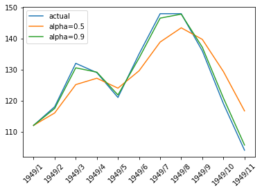


### 3. 探索式分析(EDA)

常规来说，EDA有一些通用方法，如直方图观察频率分布情况，散点图观察不同列的相关关系，折线图观察趋势变化等，这里不做赘述，下面重点将介绍针对时间序列的特殊方法。

#### 3.1 针对时间序列的特殊方法

对于一个时间序列数据，我们要问的第一个问题是它**是否反映一个平稳的系统**。平稳性的评估很重要，因为这让我们知道在多大程序上历史数据可以用来预测未来数据。确认了平稳性后，我们要接着探索时间序列**是否存在一些内部动态关系**（例如季节性变化），也叫自相关性，这能解释未来数据和历史数据之间有多紧密的关联性。最后，我们需要确保我们找到的关联是**真正的因果关系**，而不是虚假的相关性。

##### 3.1.1 理解平稳性

许多时间序列的统计学模型都是依赖于时间序列是平稳的这一前提条件，通常来说，一个平稳的时间序列指的是这个时间序列在一段时间内具有稳定的统计值，如均值，方差。由于我们对于一个数据是否平稳是有自己的直觉的，所以在实践的过程中要谨防过于依赖直觉而被直觉所欺骗。

为此我们引入了一些统计上的假设检验来测试一个时间序列数据的平稳性。

其中Augmented Dickey Fuller Test (ADF Test) 是最常使用的一种方法，ADF test也是单位根检验（unit root test）的一种。单位根是一个使得时间序列非平稳的一个特征，从技术上说，在下面的公式中如果alpha=1，那么我们说存在单位根。
$$
Y_t = \alpha Y_{t-1} + \beta X_e + \epsilon
$$
其中$Y_t，Y_{t-1}$分别表示t时刻和t-1时刻的时间序列值，$X_e$表示外生变量，$\epsilon$表示误差项。

从直觉上我们可以理解为，只有当alpha<1时，整个时间序列的趋势才是有可能出现逆转的。而ADF test就是对alpha值的假设检验，它的原假设是alpha =1，即原假设成立，则时间序列非平稳。

但是我们需要记住，ADF test不是一个永远行之有效的方法，它存在一些不足：

- 对于区分近似单位根(near unit roots)和单位根不是很有效
- 当数据点很少时，容易出现假阳性的问题
- 大多数测试不会检测所有导致非平稳的因素，例如有些测试只是检验均值或方差两者之一是否平稳，有些测试只是检验总体分布。因此在使用任何假设检验时都要先充分理解数据的特点和检验的限制因素。

此外还有一种Kwiatkowski-Phillips-Schmidt-Shin (KPSS) test也是常用的时间序列平稳性假设检验，它和ADF的区别是KPSS的原假设是关于平稳过程，而ADF的原假设是关于单位根。

时间序列平稳性的重要性在于：

1. 大量的统计学模型基于平稳性的假设
2. 对于一个应用于非平稳时间序列的模型，它的准确性和模型指标会随着时间序列本身变化而变化，从而造成模型本身不稳定。

而对于一个非平稳的时间序列，其实是可以通过一些简单的变换使之变成平稳性的。log变换和平方根变换是两个常用的方式，其适用于非等方差的场景。另外可以通过差分的方式消除时间序列趋势。

**Python代码实现**

```python
from statsmodels.tsa.stattools import adfuller
import pandas as pd
import numpy as np
%matplotlib inline
```

```python
# 导入原始数据
url = 'data/a10.csv'
df = pd.read_csv(url, parse_dates=['date'], index_col='date')
series = df.loc[:, 'value'].values
df.plot(figsize=(14,8), legend=None, title='a10 - Drug Sales Series')
```


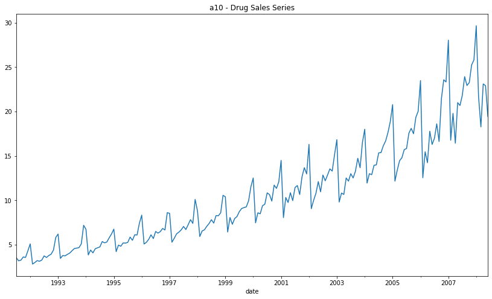
    

```python
# 使用ADF Test
result = adfuller(series, autolag='AIC')
print(f'ADF Statistic: {result[0]}')
print(f'n_lags: {result[1]}')
print(f'p-value: {result[1]}')
```

    ADF Statistic: 3.1451856893067363
    n_lags: 1.0
    p-value: 1.0


**p值为1表示没有理由拒绝原假设，也就是存在单位根，时间序列非平稳，这也和我们的直觉是相符的**


```python
# 生产一组随机数检验平稳性
series1 = np.random.randn(100)
plt.plot(series1)
```


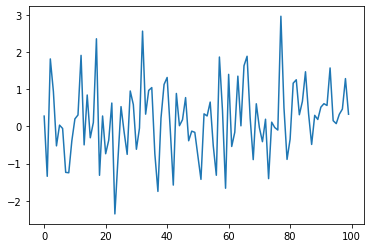
    

```python
result1 = adfuller(series1, autolag='AIC')
print(f'ADF Statistic: {result1[0]}')
print(f'p-value: {result1[1]}')
```

    ADF Statistic: -9.588680806555054
    p-value: 2.0639843020333296e-16

**p值远远小于0.05，表示拒绝原假设，即时间序列是平稳的**


##### 3.1.2 寻找自相关

自相关是时间序列的一个重要概念，指的是时间序列中某一个时刻的值和另一个时刻的值具有一定的相关性。举例来说，有一个每天更新的气温数据，你可能会发现每年5月15号和8月15号的气温存在某种关联，当年5月15号更热，则对应的8月15号也更热。当然还有一种可能性是这种关联性趋近于0， 知道5月15号的气温并不会给你任何关于8月15号气温的信息。

为了进一步探索自相关，需要引入两个函数，自相关函数和偏自相关函数来描述这一现象。

**The autocorrelation function **

自相关（acf）函数描述的是一组时间序列和它前面间隔n个时刻的一组时间序列之前的相关性。

关于acf有一些重要的事实：

- 周期性序列的acf值和原始序列具有相同的周期性
- 对几个周期性序列的和计算acf，和分别计算每个周期性序列的acf再相加，结果是一样的
- 所有时间序列在间隔lag=0时的acf值都为1，也就是时间序列和它本身之前具有完全的正相关性
- 一个完全的白噪声序列，它在任何间隔处的acf都近似于0
- 对于任何一个时间序列，它在5%的置信度下的acf值不显著为0的置信区间临界值为$± \frac{1.96} {\sqrt{T-d}}$，其中T为样本量，d为时间间隔，从公式中可以得出，随着时间间隔d的增大，置信区间也是在不断增大的，也就是说距离越远的相关性越不可信。

**The partial autocorrelation function **

偏自相关（pacf）函数描述的是一组时间序列和它前面间隔n个时刻的一组时间序列之前的偏相关性。这里的偏相关性可以从本质上理解为去除了样本之间的干涉，也就是更早时刻的相关性影响。

举例来说，计算时间间隔3的pacf是去除了时间间隔小于3的样本的影响，而只计算由于时间间隔为3时的时间序列之间的相关性，因为时间间隔为1和2的样本的影响已经在前面的pacf函数中计算过了。通过之后python实战的例子可以帮助我们理解这个概念。

关于pacf也有一些有趣的事实：

- 对于周期性时间序列，pacf会迅速趋近于0，而不像是acf一样呈现周期性，因此pacf没有太多冗余信息存在。这对于我们判断要收集多长的时间序列才能获取足够多的信息具有很大的帮助。
- pacf的置信区间临界值和acf相同

在下面的python实战部分，我们会看到一个平稳时间序列的例子和一个非平稳时间序列的例子。

**Python代码实现**

```python
# 导入气温数据
series = pd.read_csv('data/daily-min-temperatures.csv', header=0, index_col=0,
parse_dates=True, squeeze=True)
```


```python
# 画出最低气温时间序列
plt.plot(series)
```


```python
# 画出acf函数
# 蓝色底色区域内画出的是95%置信区间，数据落在蓝色区域内表示在统计学意义上在x轴的时间间隔下具有自相关性
plot_acf(series)
plt.show()
```


    

```python
# 画出pacf函数
plot_pacf(series)
plt.show()
```


    


```python
# 构造一个非平稳线性增长时间序列
x= np.linspace(1,100,100)
plt.plot(x)
```


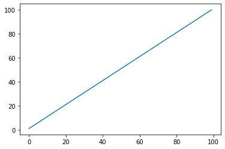
    

```python
plot_acf(x)
plt.show()
```


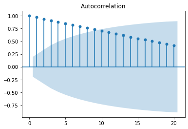
    


```python
plot_pacf(x)
plt.show()
# 从这个例子可以看到，从lag>=2开始，pacf值几乎都等于0，而lag=1时的pacf值近似于1，这说明所有的相关性都可以在间隔=1加以解释，后面的时间序列只是产生了大量的冗余信息，并没有新的信息
```


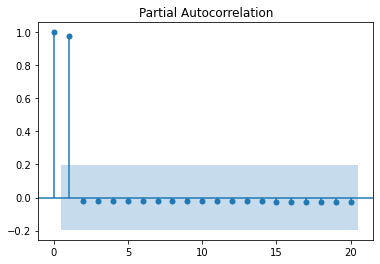
    

##### 3.1.3 虚假相关性

时间序列分析的新人分析师通常会从标准的探索性数据开始实践，例如将两个变量相互绘制并计算它们的相关性。当他们注意到变量之间非常强的相关性时，会非常兴奋。但是当分析师向其他人展示他们的发现，会意识到这一切都没有意义。有人会质疑指出相关性有些过于高了，并且当新人分析师尝试用更多变量重新运行他们的分析时，会发现更多变量之间也具有惊人的高相关性。但实际上我们都清楚，现实生活中有不可能有这么多真正的高相关性。

这个情况非常像计量经济学的早期历史。在 19 世纪，当经济学家第一次开始思考商业周期的概念时，他们去寻找影响周期的外部驱动因素，例如太阳黑子（11 年的周期）或各种气象周期（例如 4 年的降水周期）。他们总是得到非常积极和高度相关的结果，即使他们并没有因果关系来解释这些结果。这些都是所谓的虚假相关性。

具有潜在趋势的数据很可能产生虚假的相关性，例如碳排放量的上升和变暖的全球气温之间的相关性。
除了趋势之外，时间序列的其他一些共同特征也会引入虚假相关性：

- 季节性，例如考虑夏天热狗消费量和溺水死亡人数的相关性

- 随着时间的推移，状态变化引起的数据水平或斜率变化

- 累计数量的相关性，这被许多行业广泛用于人为制造更强相关性的技巧

因此在实践中发现极强相关性的时候一定要结合行业经验仔细验证，不能盲目相信数据上的结果。

这个网站[http://tylervigen.com/spurious-correlations](http://tylervigen.com/spurious-correlations)，记录了许多虚假相关性的例子，表面上看起来相关关系都惊人的高。

例如这个美国在科技领域的花费和自杀率之间的时间序列相关性。

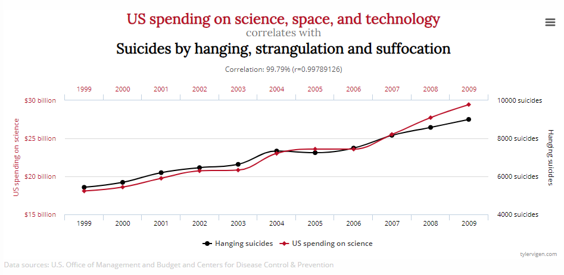


#### 3.2 常用的可视化图表

可视化是数据探索的一个重要工具，相比于数据本身，使用图表能让我们更容易发现数字背后的信息，帮助我们理解数据，例如某一个变量的行为，或是总体时间分布的特点。

一维数据可视化可以帮助理解个体的独立时间分布特点，二维数据可视化可以帮助理解某个变量值同时在时间轴和另一个变量维度上的轨迹特征，而对于三维数据可视化，虽然可以在更高的维度上观察数据，但是在可视化领域其实不太推荐使用这类图表，因为在视觉上不清晰，容易造成误导。

##### 3.2.1 1D可视化

一种常用的一维可视化形式是甘特图，在项目管理中较为常见，下面的这个可视化例子是展示了不同任务在时间轴上的起始分布和工作量。

```python
job = pd.read_csv('data/job.csv')
job.start = job.start.astype('datetime64')
job.finish = job.finish.astype('datetime64')
```


```python
px.timeline(job,x_start='start',x_end='finish',y='task',color='task',text='loading')
```

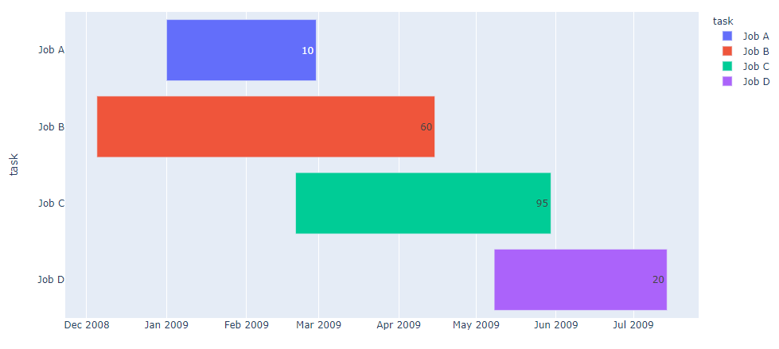

##### 3.2.2 2D可视化

二维可视化可以展现更多信息，下面就以美国航空乘客数据来展示常用的可视化图表。


```python
air = pd.read_csv('data/AirPassengers.csv',parse_dates=['date'])
```


```python
air['year'] = air['date'].dt.year
air['month']=air['date'].dt.month
```

对于时间序列数据，折线图很自然是最适合的表现形式之一，以年份为分类变量，可以展示在一年中的各个月份下航空乘客的变化关系，发现无论在哪一年，几乎都呈现夏季航空出行量最高的规律。


```python
palette = sns.color_palette('hls',12)
fig=sns.lineplot(x='month',y='value',data=air,hue='year',palette=palette)
fig.set_xticks(range(1,13))
fig.set_xticklabels(["Jan", "Feb", "Mar", "Apr","May", "Jun", "Jul", "Aug","Sep", "Oct", "Nov", "Dec"])
plt.show()
```


    

如果换一种方式绘制折线图，以月份为分类变量，年份为X轴，可以看出1949-1960这十多年间是航空业大发展的时期，整体的航空出行量都在显著增加。

```python
fig=sns.lineplot(x='year',y='value',data=air,hue='month',palette=palette)
plt.show()
```


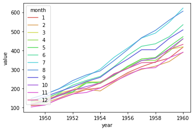
    

还有一种常见的二维可视化方式是热力图，将原始数据拆成年和月两个维度，同样可以清楚直观地看出航空出行在时间维度上的规律。

```python
air_mat= air.pivot(index='year', columns='month',values='value')
```


```python
sns.heatmap(data=air_mat,annot=True,fmt='d',linewidths=0.5)
plt.show()
```


    

### 4. 基于统计学的时间序列分析方法

本章将正式开始时间序列分析方法的内容，我们会先从统计学方法开始讲起，这类方法最为传统，在学术研究和工业模型等领域都已经有了十分广泛的应用。这类方法和线性回归有一定类似，会用到线性回归来解释不同时间下数据点之间的关系。和一般线性回归的区别是一般线性回归分析假定不同数据点之间是独立的，而时间序列数据分析的一个重要前提是各个数据点之间存在关联。

#### 4.1 自回归模型（Autoregressive)

自回归模型（AR）基于的基础是可以用历史预测未来，也就是时刻t的数据能用之前时刻的函数来表示。

自回归模型是很多人在拟合时间序列数据时最先尝试的模型，尤其是在对该数据没有额外的了解时。它的基本公式可以用以下公式表示，
$$
y_t = b_0 + b_1 * y_{t -1} + e_t
$$

这个最简单的模型称为AR(1)，其中括号中的1表示时间间隔为1，也就是当前时刻的数据值的计算只考虑到前一个时刻的值。从公式可以看出，它和常规的线性回归十分类似，$ b_0,b_1 $分别代表截距项和回归系数，$ e_t$表示t时刻的错误项，其中错误项均值为0，具有固定方差。这个公式表示的是用t-1时刻的时间序列值来拟合t时刻的时间序列值。

AR模型可以扩展到p个近邻时间值，此时称为AR(p)。
$$
y_t = \phi_0 + \phi_1 * y_{t -1} + \phi_2 * y_{t -2} + ... + \phi_p * y_{t - p} + e_t
$$
其中$\phi$表示一系列回归系数。


**python实战演练**

在实战中我们应当注意使用AR模型的两个前提假定：

- 过去发生的数据能够用来预测未来的数据（也就是数据之间是非独立的）
- 时间序列数据时平稳的

如果数据集是不平稳的，需要使用一些操作将数据去除趋势项和季节项使其变得平稳。

*冷知识：平稳性非为强平稳性和弱平稳性，其中强平稳性要求数据的分布不随时间变化，而弱平稳性仅仅要求数据的一阶距和二阶矩（均值和方差）不随时间变化。*

```python
import matplotlib.pyplot as plt
import pandas as pd
from statsmodels.tsa.ar_model import AutoReg
from statsmodels.tsa.seasonal import seasonal_decompose
%matplotlib inline
```


```python
# 导入销售数据，绘制原始图像
sales_data = pd.read_csv('data/retail_sales.csv')
sales_data['date']=pd.to_datetime(sales_data['date'])
sales_data.set_index('date', inplace=True)
sales_data.plot()
```


    


我们提到使用AR模型的两个前提假设，相关性和平稳性。
因此先来检验相关性。

检验相关性有两种方法
- pandas提供了autocorrelation_plot方法用于检验整体自相关性
- 使用pandas的lag_plot方法检查单个时间间隔的相关性


```python
pd.plotting.autocorrelation_plot(sales_data['sales']) 
# 从自相关性图中可以看到在lag<=12时，acf值在临界点以外，表现出极强的相关性。
```


    

```python
# 将上图中相关性最强的lag=12单独画散点图，观察相关性
pd.plotting.lag_plot(sales_data['sales'],lag=12)
```


    


第二步检查平稳性，一个最快捷的方法之一是使用statsmodels中的seasonal_decompose方法进行趋势项和季节项的分解。


```python
# 数据集存在明显趋势项（图二单调递增）和季节项（图三周期性变化）
decomposed = seasonal_decompose(sales_data['sales'], model='additive')
x = decomposed.plot()
```


    


幸好statsmodel包的AutoReg方法增加了对趋势和季节项特征的处理，直接使用该方法即可


```python
# 划分训练集合测试集
X = sales_data['sales']
train_data = X[1:len(X)-12]
test_data = X[len(X)-12:]  #以最后十二个点作为待预测值

# 训练AR模型
model = AutoReg(train_data,lags=15,missing='drop',trend='t',seasonal=True) 
model_fitted = model.fit()
```


```python
# 查看模型结果
model_fitted.summary()
```


<table class="simpletable">
<caption>AutoReg Model Results</caption>
<tr>
  <th>Dep. Variable:</th>       <td>sales</td>       <th>  No. Observations:  </th>    <td>59</td>   
</tr>
<tr>
  <th>Model:</th>         <td>Seas. AutoReg(15)</td> <th>  Log Likelihood     </th> <td>-422.998</td>
</tr>
<tr>
  <th>Method:</th>         <td>Conditional MLE</td>  <th>  S.D. of innovations</th> <td>3621.518</td>
</tr>
<tr>
  <th>Date:</th>          <td>Tue, 22 Jun 2021</td>  <th>  AIC                </th>  <td>17.707</td> 
</tr>
<tr>
  <th>Time:</th>              <td>22:47:53</td>      <th>  BIC                </th>  <td>18.883</td> 
</tr>
<tr>
  <th>Sample:</th>           <td>02-01-2011</td>     <th>  HQIC               </th>  <td>18.144</td> 
</tr>
<tr>
  <th></th>                 <td>- 09-01-2014</td>    <th>                     </th>     <td> </td>   
</tr>
</table>
<table class="simpletable">
<tr>
       <td></td>          <th>coef</th>     <th>std err</th>      <th>z</th>      <th>P>|z|</th>  <th>[0.025</th>    <th>0.975]</th>  
</tr>
<tr>
  <th>trend</th>       <td>  839.9681</td> <td>  362.378</td> <td>    2.318</td> <td> 0.020</td> <td>  129.721</td> <td> 1550.216</td>
</tr>
<tr>
  <th>seasonal.0</th>  <td> 2.213e+05</td> <td> 8.34e+04</td> <td>    2.653</td> <td> 0.008</td> <td> 5.78e+04</td> <td> 3.85e+05</td>
</tr>
<tr>
  <th>seasonal.1</th>  <td> 2.808e+05</td> <td> 8.08e+04</td> <td>    3.476</td> <td> 0.001</td> <td> 1.22e+05</td> <td> 4.39e+05</td>
</tr>
<tr>
  <th>seasonal.2</th>  <td> 1.924e+05</td> <td>  8.7e+04</td> <td>    2.212</td> <td> 0.027</td> <td> 2.19e+04</td> <td> 3.63e+05</td>
</tr>
<tr>
  <th>seasonal.3</th>  <td> 1.689e+05</td> <td> 8.69e+04</td> <td>    1.945</td> <td> 0.052</td> <td>-1331.228</td> <td> 3.39e+05</td>
</tr>
<tr>
  <th>seasonal.4</th>  <td> 2.263e+05</td> <td> 8.29e+04</td> <td>    2.728</td> <td> 0.006</td> <td> 6.37e+04</td> <td> 3.89e+05</td>
</tr>
<tr>
  <th>seasonal.5</th>  <td> 2.335e+05</td> <td> 7.98e+04</td> <td>    2.926</td> <td> 0.003</td> <td> 7.71e+04</td> <td>  3.9e+05</td>
</tr>
<tr>
  <th>seasonal.6</th>  <td>  2.09e+05</td> <td> 8.26e+04</td> <td>    2.530</td> <td> 0.011</td> <td> 4.71e+04</td> <td> 3.71e+05</td>
</tr>
<tr>
  <th>seasonal.7</th>  <td> 2.318e+05</td> <td> 8.32e+04</td> <td>    2.785</td> <td> 0.005</td> <td> 6.87e+04</td> <td> 3.95e+05</td>
</tr>
<tr>
  <th>seasonal.8</th>  <td>  2.33e+05</td> <td> 8.41e+04</td> <td>    2.771</td> <td> 0.006</td> <td> 6.82e+04</td> <td> 3.98e+05</td>
</tr>
<tr>
  <th>seasonal.9</th>  <td> 2.224e+05</td> <td>  8.4e+04</td> <td>    2.648</td> <td> 0.008</td> <td> 5.78e+04</td> <td> 3.87e+05</td>
</tr>
<tr>
  <th>seasonal.10</th> <td> 1.901e+05</td> <td> 8.46e+04</td> <td>    2.246</td> <td> 0.025</td> <td> 2.42e+04</td> <td> 3.56e+05</td>
</tr>
<tr>
  <th>seasonal.11</th> <td> 2.123e+05</td> <td> 8.59e+04</td> <td>    2.473</td> <td> 0.013</td> <td>  4.4e+04</td> <td> 3.81e+05</td>
</tr>
<tr>
  <th>sales.L1</th>    <td>    0.2604</td> <td>    0.155</td> <td>    1.685</td> <td> 0.092</td> <td>   -0.042</td> <td>    0.563</td>
</tr>
<tr>
  <th>sales.L2</th>    <td>    0.1237</td> <td>    0.158</td> <td>    0.785</td> <td> 0.433</td> <td>   -0.185</td> <td>    0.433</td>
</tr>
<tr>
  <th>sales.L3</th>    <td>    0.0379</td> <td>    0.150</td> <td>    0.252</td> <td> 0.801</td> <td>   -0.256</td> <td>    0.332</td>
</tr>
<tr>
  <th>sales.L4</th>    <td>   -0.2515</td> <td>    0.149</td> <td>   -1.691</td> <td> 0.091</td> <td>   -0.543</td> <td>    0.040</td>
</tr>
<tr>
  <th>sales.L5</th>    <td>    0.2431</td> <td>    0.163</td> <td>    1.496</td> <td> 0.135</td> <td>   -0.075</td> <td>    0.562</td>
</tr>
<tr>
  <th>sales.L6</th>    <td>   -0.1179</td> <td>    0.163</td> <td>   -0.722</td> <td> 0.470</td> <td>   -0.438</td> <td>    0.202</td>
</tr>
<tr>
  <th>sales.L7</th>    <td>   -0.1311</td> <td>    0.164</td> <td>   -0.799</td> <td> 0.424</td> <td>   -0.453</td> <td>    0.190</td>
</tr>
<tr>
  <th>sales.L8</th>    <td>   -0.0212</td> <td>    0.196</td> <td>   -0.108</td> <td> 0.914</td> <td>   -0.406</td> <td>    0.363</td>
</tr>
<tr>
  <th>sales.L9</th>    <td>    0.2763</td> <td>    0.201</td> <td>    1.374</td> <td> 0.169</td> <td>   -0.118</td> <td>    0.670</td>
</tr>
<tr>
  <th>sales.L10</th>   <td>    0.0443</td> <td>    0.200</td> <td>    0.222</td> <td> 0.825</td> <td>   -0.347</td> <td>    0.436</td>
</tr>
<tr>
  <th>sales.L11</th>   <td>    0.1980</td> <td>    0.203</td> <td>    0.975</td> <td> 0.330</td> <td>   -0.200</td> <td>    0.596</td>
</tr>
<tr>
  <th>sales.L12</th>   <td>    0.1034</td> <td>    0.202</td> <td>    0.512</td> <td> 0.609</td> <td>   -0.292</td> <td>    0.499</td>
</tr>
<tr>
  <th>sales.L13</th>   <td>   -0.4173</td> <td>    0.206</td> <td>   -2.029</td> <td> 0.042</td> <td>   -0.820</td> <td>   -0.014</td>
</tr>
<tr>
  <th>sales.L14</th>   <td>    0.0320</td> <td>    0.192</td> <td>    0.166</td> <td> 0.868</td> <td>   -0.345</td> <td>    0.409</td>
</tr>
<tr>
  <th>sales.L15</th>   <td>    0.0085</td> <td>    0.206</td> <td>    0.041</td> <td> 0.967</td> <td>   -0.396</td> <td>    0.413</td>
</tr>
</table>
<table class="simpletable">
<caption>Roots</caption>
<tr>
    <td></td>    <th>            Real</th>  <th>         Imaginary</th> <th>         Modulus</th>  <th>        Frequency</th>
</tr>
<tr>
  <th>AR.1</th>  <td>          -0.9178</td> <td>          -0.4910j</td> <td>           1.0409</td> <td>          -0.4218</td>
</tr>
<tr>
  <th>AR.2</th>  <td>          -0.9178</td> <td>          +0.4910j</td> <td>           1.0409</td> <td>           0.4218</td>
</tr>
<tr>
  <th>AR.3</th>  <td>          -1.1752</td> <td>          -0.0000j</td> <td>           1.1752</td> <td>          -0.5000</td>
</tr>
<tr>
  <th>AR.4</th>  <td>          -0.6070</td> <td>          -0.8247j</td> <td>           1.0241</td> <td>          -0.3510</td>
</tr>
<tr>
  <th>AR.5</th>  <td>          -0.6070</td> <td>          +0.8247j</td> <td>           1.0241</td> <td>           0.3510</td>
</tr>
<tr>
  <th>AR.6</th>  <td>          -0.0849</td> <td>          -1.1181j</td> <td>           1.1213</td> <td>          -0.2621</td>
</tr>
<tr>
  <th>AR.7</th>  <td>          -0.0849</td> <td>          +1.1181j</td> <td>           1.1213</td> <td>           0.2621</td>
</tr>
<tr>
  <th>AR.8</th>  <td>           0.3804</td> <td>          -0.9597j</td> <td>           1.0323</td> <td>          -0.1899</td>
</tr>
<tr>
  <th>AR.9</th>  <td>           0.3804</td> <td>          +0.9597j</td> <td>           1.0323</td> <td>           0.1899</td>
</tr>
<tr>
  <th>AR.10</th> <td>           0.8226</td> <td>          -0.5979j</td> <td>           1.0170</td> <td>          -0.1000</td>
</tr>
<tr>
  <th>AR.11</th> <td>           0.8226</td> <td>          +0.5979j</td> <td>           1.0170</td> <td>           0.1000</td>
</tr>
<tr>
  <th>AR.12</th> <td>           1.1469</td> <td>          -0.1677j</td> <td>           1.1591</td> <td>          -0.0231</td>
</tr>
<tr>
  <th>AR.13</th> <td>           1.1469</td> <td>          +0.1677j</td> <td>           1.1591</td> <td>           0.0231</td>
</tr>
<tr>
  <th>AR.14</th> <td>           5.1284</td> <td>          -0.0000j</td> <td>           5.1284</td> <td>          -0.0000</td>
</tr>
<tr>
  <th>AR.15</th> <td>          -9.1838</td> <td>          -0.0000j</td> <td>           9.1838</td> <td>          -0.5000</td>
</tr>
</table>


```python
# 预测测试集
predictions = model_fitted.predict(
    start=len(train_data), 
    end=len(train_data) + len(test_data)-1, 
    dynamic=False)  # dynamic参数表示是否用预测值动态预测下一个时刻的值

# 比较真实值和预测值
compare_df = pd.concat(
    [sales_data['sales'].tail(12),
    predictions], axis=1).rename(
    columns={'sales': 'actual', 0:'predicted'})
compare_df.plot()
```


    

#### 4.2 移动平均模型（Moving Average）

移动平均模型（MA）依赖的基础是每个时刻点的值是历史数据点错误项的函数，其中这些错误项是互相独立的。

MA模型和AR模型的公式很类似，只是将公式中的历史数值替换成了历史数据的错误项e，由于错误项e是互相独立的，所以在MA模型中，t时刻的数值仅仅和最近的q个数值有关，而和更早的数据之间没有自相关性，在下面的实战中可以看到，如果对MA序列绘制ACF图，它的自相关关系是突然截断的。而AR序列的ACF图常常是缓慢下降的。
$$
y_t = \mu + e_t + \theta_1 * e_{t -1} + \theta_2 * e_{t -2} + ... + \theta_q * y_{t - q}
$$
同样的，和AR模型类似，满足上述公式的时间序列可以用MA(q)来表示。

**python代码实战 **

```python
import matplotlib.pyplot as plt
import numpy as np
from statsmodels.tsa.arima_model import ARMA
from statsmodels.tsa.arima_process import ArmaProcess
from statsmodels.graphics.tsaplots import plot_acf
%matplotlib inline
```

模拟MA序列


```python
# ar,ma必须以array的形式输入，且第一位表示lag=0，通常这个值会设为1
ar = np.array([1])  # ar项只有一个间隔=0的值表示是一个纯MA序列
ma = np.array([1, -0.9]) # ma序列有两个值，第一个是常数项，第二个是前一个时刻的系数，这是一个MA(1)模型
MA_object = ArmaProcess(ar, ma)
simulated_data = MA_object.generate_sample(nsample=1000)
plt.plot(simulated_data)
```


    


```python
# 画出acf图像后看到，如上文所说，对于一个MA(1)序列，从时间间隔大于等于2开始，相关系数断崖式下降
plot_acf(simulated_data, lags=20)
plt.show()
```


    

模型拟合与评估


```python
# order=(0,1)表示这是一个纯MA(1)模型
mod = ARMA(simulated_data_1, order=(0, 1))  
res = mod.fit()

# 观察模型拟合结果， 系数为-0.8937，和我们创建时间序列的系数-0.9很接近
print(res.summary())

# 打印拟合值
print(res.params)
```

    [-6.05711676e-04 -8.93691112e-01]

模型预测


```python
res.plot_predict(start=990, end=1010)
plt.show()
```


    


可以看到MA模型仅仅对样本内的值有实际预测效果，对样本外的值会用统一用整体均值来预测

#### 4.3 差分整合移动平均自回归模型（**A**uto**r**egressive **I**ntegrated **M**oving **A**verage）

在了解了AR和MA模型后，我们将进一步学习结合了这两者的ARIMA模型，ARIMA在时间序列数据分析中有着非常重要的地位。但在这之前，让我们先来看ARIMA的简化版ARMA模型（**A**uto**r**egressive **m**oving **a**verage model），ARMA同样是结合了AR和MA模型，公式如下：
$$
y_t = c + \phi_1 * y_{t -1} + \phi_2 * y_{t -2} + ... + \phi_p * y_{t - p}   + e_t + \theta_1 * e_{t -1} + \theta_2 * e_{t -2} + ... + \theta_q * y_{t - q}
$$
可以看出，ARMA模型就是AR和MA的简单结合，同时包含了历史数值项和错误项。由于AR模型对时间序列有平稳性要求，ARMA模型也存在这个限制，因此我们将其拓展到ARIMA模型，引入的差分概念是一种获得时间序列的方法。最常使用的一种差分方法是计算当前项和前项的差值，获得一组新的时间序列。由于ARIMA强大的功能，这使得在统计领域有着非常广泛的应用，尤其适用于机器学习和深度学习难以应用的小样本数据集上，同时也应当警惕过拟合的情况发生。

当我们拿到一个陌生的数据集时，可能会思考应当使用AR，MA，还是结合AR和MA的模型，一个简单的准则是画出ACF和PACF曲线，根据其特征来判断。

| 函数     | AR(p)              | MA(q)              | ARMA or ARIMA  |
| -------- | ------------------ | ------------------ | -------------- |
| ACF曲线  | 缓缓下降           | 在间隔=q后突然下降 | 没有明显截止点 |
| PACF曲线 | 在间隔=p后突然下降 | 缓缓下降           | 没有明显截止点 |

在实际分析过程中，我们也可以一律使用ARIMA模型，因为AR,MA,ARMA都是它的一种特殊情况。

ARIMA有三个参数p、d、q，写作ARIMA（p,d,q），其中p代表AR(p)，自回归阶数，d代表Integrated (d)，差分阶数，q代表MA(q)，移动平均阶数。我们应当确保这三个参数尽可能的小避免过拟合，一个可供参数的准则是，不要让d超过2，p和q超过5，并且p和q尽量保证一个是模型主导项，另一个相对较小。

ARIMA有一些经典的特殊例子：

- ARIMA(0, 0, 0) 是白噪声模型
- ARIMA(0, 1, 0)是随机行走模型
- ARIMA(0, 1, 1) 是指数平滑模型，而ARIMA(0, 2, 2) 是Holt线性趋势模型

**python代码实战**

如何确定ARIMA模型的参数通常有两种方法，手动拟合法和自动拟合法。

手动拟合法是一种经验方法，最著名的方法被称为`Box-Jenkins method`，这是一个多步迭代过程，分为以下几个步骤，

1. 结合对数据集的可视化和领域知识选择一组合适的模型
2. 拟合模型
3. 根据模型表现微调参数，以解决模型表现不佳的地方

通过一个简单的例子来学习手动box-jenkins方法的使用过程。


```python
import matplotlib.pyplot as plt
import pandas as pd
import statsmodels.api as sm
from statsmodels.tsa.arima.model import ARIMA
from statsmodels.tsa.arima_process import ArmaProcess
from statsmodels.graphics.tsaplots import plot_acf
from statsmodels.graphics.tsaplots import plot_pacf
from pmdarima.arima import auto_arima
from pmdarima.arima import ADFTest
```


```python
# 模拟ARMA数据，在完成最终拟合前，请假装不知道样本时间序列的参数
import statsmodels.api as sm
ar = np.array([1,-0.8, 0.4])  
ma = np.array([1,-0.7]) 
arma_process = sm.tsa.ArmaProcess(ar, ma)
y = arma_process.generate_sample(1000)
plt.plot(y)
```


    

```python
# step1 - 画出acf，pacf曲线，根据经验规则，没有明显的cutoff，模型应当包含AR和MA项
plot_acf(y)
plot_pacf(y)
plt.show()
```


    


    

```python
# step2，用最简单的arima(1,0,1)尝试拟合
mod = ARIMA(y, order=(1,0,1))  
res = mod.fit()
```


```python
# step3，画出拟合残差的acf和pacf
plot_acf(res.resid)
plot_pacf(res.resid)
plt.show()
```


    


    

```python
# step4，从上面对residual绘制acf和pacf可以看到，还存在有显著的自相关性，说明最开始尝试的ARIMA(1,0,1)模型并没有充分表达原数据  
# 尝试增加模型复杂度
a2m1 = ARIMA(y, order=(2,0,1)).fit()  
plot_acf(a2m1.resid)
plot_pacf(a2m1.resid)
plt.show()
```


    


    

```python
# step5，通过将AR项从一阶改成二阶，这个更复杂的模型取得了不错的效果，残差的acf和pacf几乎看不到其他相关性存在  
# 为了验证是否还能获得更好的模型，继续修改参数进行测试，一个简单快速的验证方式是计算真实值和预测值的相关系数
def model_performance(p,d,q):
    model = ARIMA(y, order=(p,d,q)).fit()  
    df = pd.DataFrame({'predict':model.predict(),'true':y})
    corr = df.corr().loc['predict','true']
    print("ARIMA({0},{1},{2}) performance: {3} ".format(p,d,q,corr))
```


```python
model_performance(1,0,1)
model_performance(2,0,1)
model_performance(1,0,2)
model_performance(2,0,2)
model_performance(2,1,2)
```

    ARIMA(1,0,1) performance: 0.23256695743385164 
    ARIMA(2,0,1) performance: 0.42499463153273376 
    ARIMA(1,0,2) performance: 0.39161778792506313 
    ARIMA(2,0,2) performance: 0.42705219696176494 
    ARIMA(2,1,2) performance: 0.4152659567936595 


可以看到ARIMA(2,0,1)的效果有了明显提升，而当再增加模型复杂度时，效果没有明显提升。当然这只是一个极为粗略的手动拟合的例子，真实场景则需要更为精细的优化。


```python
ARIMA(y, order=(2,0,1)).fit().params # 模型系数 ar1=0.79,ar2=-0.4,ma1=-0.69和最开始我们创建的时间序列系数很接近，获得了不错的拟合效果
```


    array([ 0.00219359,  0.78972449, -0.40471765, -0.68275666,  0.97684689])

从上面的例子中可以看出手动拟合法较为复杂，对经验要求很高，一些统计学家也长期致力于这类方法的优化思路。但同时也受到了一些人的批评，认为这种纯手工的方法效率太低，而且很依赖经验，不是最优的方法。

下面就来学习如何进行自动拟合。

**自动拟合法**


```python
# step1，准备数据
sales_data = pd.read_csv('data/retail_sales.csv')
sales_data['date']=pd.to_datetime(sales_data['date'])
sales_data.set_index('date', inplace=True)
sales_data.plot()
```


    

```python
# step2，检查平稳性
adf_test = ADFTest()
adf_test.should_diff(sales_data) #结果表明不平稳，提示我们需要引入差分项
```


    (0.01, False)


```python
# step3，划分训练集和测试集
train = sales_data[:60]
test = sales_data[60:]
```


```python
# step4，拟合模型
arima_model = auto_arima(train, start_p=0, d=1,start_q=0, max_p=5,max_d=5,max_q=5,
                         start_P=0, D=1, start_Q=0, max_P=5, max_D=5, max_Q=5, m=12, seasonal=True,trace=True,n_fits=50)
```

    Performing stepwise search to minimize aic
     ARIMA(0,1,0)(0,1,0)[12]             : AIC=981.377, Time=0.02 sec
     ARIMA(1,1,0)(1,1,0)[12]             : AIC=982.734, Time=0.11 sec
     ARIMA(0,1,1)(0,1,1)[12]             : AIC=982.307, Time=0.14 sec
     ARIMA(0,1,0)(1,1,0)[12]             : AIC=983.595, Time=0.13 sec
     ARIMA(0,1,0)(0,1,1)[12]             : AIC=1005.088, Time=0.06 sec
     ARIMA(0,1,0)(1,1,1)[12]             : AIC=1007.898, Time=0.31 sec
     ARIMA(1,1,0)(0,1,0)[12]             : AIC=981.328, Time=0.02 sec
     ARIMA(1,1,0)(0,1,1)[12]             : AIC=982.703, Time=0.13 sec
     ARIMA(1,1,0)(1,1,1)[12]             : AIC=984.307, Time=0.68 sec
     ARIMA(2,1,0)(0,1,0)[12]             : AIC=987.645, Time=0.04 sec
     ARIMA(1,1,1)(0,1,0)[12]             : AIC=982.083, Time=0.19 sec
     ARIMA(0,1,1)(0,1,0)[12]             : AIC=980.880, Time=0.06 sec
     ARIMA(0,1,1)(1,1,0)[12]             : AIC=982.336, Time=0.10 sec
     ARIMA(0,1,1)(1,1,1)[12]             : AIC=983.925, Time=0.46 sec
     ARIMA(0,1,2)(0,1,0)[12]             : AIC=982.207, Time=0.08 sec
     ARIMA(1,1,2)(0,1,0)[12]             : AIC=983.139, Time=0.17 sec
     ARIMA(0,1,1)(0,1,0)[12] intercept   : AIC=982.868, Time=0.08 sec
    
    Best model:  ARIMA(0,1,1)(0,1,0)[12]          
    Total fit time: 2.802 seconds


```python
# 查看模型结果
arima_model.summary()
```


```python
# step5，预测时间序列，并和真实值比较
pred = pd.DataFrame(arima_model.predict(n_periods=12),columns=['predicted'],index=test.index)
```


```python
plt.plot(train)
plt.plot(test,label='true')
plt.plot(pred,label='predict')
plt.legend();
```


    

#### 4.4 向量自回归模型（Vector Autoregression）

以上三个章节我们讨论的都是单变量问题，现实世界往往更为复杂，这时我们将把AR模型从单变量拓展到多变量，多变量模型的特点是存在几组并行的时间序列，并且这些时间之间互相影响。

本章讨论的模型就叫做向量自回归模型（VAR)，考虑一个三组并行时间序列数据的场景，在二阶的条件下，公式如下：
$$
y_{1,t} = \phi_{01} + \phi_{11,1} * y_{1,t -1} + \phi_{12,1} * y_{2,t -1} + \phi_{13,1} * y_{3,t -1} + \phi_{11,2} * y_{1,t -2} + \phi_{12,2} * y_{2,t -2} + \phi_{13,2} * y_{3,t -2} \\
y_{2,t} = \phi_{02} + \phi_{21,1} * y_{1,t -1} + \phi_{22,1} * y_{2,t -1} + \phi_{23,1} * y_{3,t -1} + \phi_{21,2} * y_{1,t -2} + \phi_{22,2} * y_{2,t -2} + \phi_{23,2} * y_{3,t -2} \\
y_{3,t} = \phi_{03} + \phi_{31,1} * y_{1,t -1} + \phi_{32,1} * y_{2,t -1} + \phi_{33,1} * y_{3,t -1} + \phi_{31,2} * y_{1,t -2} + \phi_{32,2} * y_{2,t -2} + \phi_{33,2} * y_{3,t -2}
$$
可以看到在AR模型的基础上，每一组时间序列的y值都加入了其他两组时间序列值作为模型因子。熟悉线性代数的读者可能已经发现，上面的三个公式可以写成向量乘法的形式，这也是VAR模型名字的由来，写作向量乘法的公式和前面学习的AR模型时完全一致的，在这个公式中，y和 $ \phi_0 $ 是$3\times1$的向量，$\phi_1, \phi_2 $ 是$3\times3$的矩阵。
$$
y = \phi_0 + \phi_1 × y_{t -1} + \phi_2 × y_{t -2}
$$
从公式中也能看到随着阶数上升，VAR模型的变量增加很快，因此在使用时只有当期待存在不同时间序列互相影响的关系时才尝试这种方法。VAR在某些场景下十分有用，

- 测试某个变量是否影响其他变量
- 大量变量需要被预测，而分析师没有太多领域知识
- 决定某个预测值在多大程度上是由潜在的因果性导致的

**python实战部分**

```python
import matplotlib.pyplot as plt
import pandas as pd
import numpy as np
from statsmodels.tsa.stattools import adfuller
from statsmodels.tsa.api import VAR
from statsmodels.tsa.stattools import grangercausalitytests
from statsmodels.tsa.vector_ar.vecm import coint_johansen
from statsmodels.stats.stattools import durbin_watson
%matplotlib inline
```

#### 


```python
# step1：导入数据，这是一个有八个指标的经济数据
df = pd.read_csv('data/Raotbl6.csv', parse_dates=['date'], index_col='date')
df.head()
```


```python
# 画出八个时间序列的图像
fig, axes = plt.subplots(nrows=4, ncols=2,figsize=(10,6))
for i, ax in enumerate(axes.flatten()):
    data = df[df.columns[i]]
    ax.plot(data, color='red', linewidth=1)
    ax.set_title(df.columns[i])
plt.tight_layout();
```


    


```python
# step2：Granger’s Causality Test ， 检验不同序列之间存在互相影响
maxlag=12
test='ssr_chi2test'
variables=df.columns
def grangers_causation_matrix(data, variables, test='ssr_chi2test', verbose=False):    
    df = pd.DataFrame(np.zeros((len(variables), len(variables))), columns=variables, index=variables)
    for c in df.columns:
        for r in df.index:
            test_result = grangercausalitytests(data[[r, c]], maxlag=maxlag, verbose=False)
            p_values = [round(test_result[i+1][0][test][1],4) for i in range(maxlag)]
            min_p_value = np.min(p_values)
            df.loc[r, c] = min_p_value
    df.columns = [var + '_x' for var in variables]
    df.index = [var + '_y' for var in variables]
    return df

grangers_causation_matrix(df, variables = df.columns)   
```


在输出结果中，index以y结尾，表示响应变量，column以x结尾，表示预测变量，如果p值小于0.05表明存在格兰杰因果性。 
因此根据检验数据，完全有理由使用VAR模型。


```python
# step3：ADF测试，检验单个变量是否平稳
def adfuller_test(series, signif=0.05, name='', verbose=False):
    r = adfuller(series, autolag='AIC')
    output = {'test_statistic':round(r[0], 4), 'pvalue':round(r[1], 4), 'n_lags':round(r[2], 4), 'n_obs':r[3]}
    p_value = output['pvalue'] 
    def adjust(val, length= 6): return str(val).ljust(length)

    # Print Summary
    print(f'    Augmented Dickey-Fuller Test on "{name}"', "\n   ", '-'*47)
    print(f' Null Hypothesis: Data has unit root. Non-Stationary.')
    print(f' Significance Level    = {signif}')
    print(f' Test Statistic        = {output["test_statistic"]}')
    print(f' No. Lags Chosen       = {output["n_lags"]}')

    for key,val in r[4].items():
        print(f' Critical value {adjust(key)} = {round(val, 3)}')

    if p_value <= signif:
        print(f" => P-Value = {p_value}. Rejecting Null Hypothesis.")
        print(f" => Series is Stationary.")
    else:
        print(f" => P-Value = {p_value}. Weak evidence to reject the Null Hypothesis.")
        print(f" => Series is Non-Stationary.")    
```


```python
for name, column in df.iteritems():
    adfuller_test(column, name=column.name)
    print('\n')
```

        Augmented Dickey-Fuller Test on "rgnp" 
        -----------------------------------------------
     Null Hypothesis: Data has unit root. Non-Stationary.
     Significance Level    = 0.05
     Test Statistic        = 0.6419
     No. Lags Chosen       = 2
     Critical value 1%     = -3.486
     Critical value 5%     = -2.886
     Critical value 10%    = -2.58
     => P-Value = 0.9886. Weak evidence to reject the Null Hypothesis.
     => Series is Non-Stationary.


​    
​        Augmented Dickey-Fuller Test on "pgnp" 
​        -----------------------------------------------
​     Null Hypothesis: Data has unit root. Non-Stationary.
​     Significance Level    = 0.05
​     Test Statistic        = 1.2743
​     No. Lags Chosen       = 1
​     Critical value 1%     = -3.486
​     Critical value 5%     = -2.886
​     Critical value 10%    = -2.58
​     => P-Value = 0.9965. Weak evidence to reject the Null Hypothesis.
​     => Series is Non-Stationary.


​    
​        Augmented Dickey-Fuller Test on "ulc" 
​        -----------------------------------------------
​     Null Hypothesis: Data has unit root. Non-Stationary.
​     Significance Level    = 0.05
​     Test Statistic        = 1.3967
​     No. Lags Chosen       = 2
​     Critical value 1%     = -3.486
​     Critical value 5%     = -2.886
​     Critical value 10%    = -2.58
​     => P-Value = 0.9971. Weak evidence to reject the Null Hypothesis.
​     => Series is Non-Stationary.


​    
​        Augmented Dickey-Fuller Test on "gdfco" 
​        -----------------------------------------------
​     Null Hypothesis: Data has unit root. Non-Stationary.
​     Significance Level    = 0.05
​     Test Statistic        = 0.5762
​     No. Lags Chosen       = 5
​     Critical value 1%     = -3.488
​     Critical value 5%     = -2.887
​     Critical value 10%    = -2.58
​     => P-Value = 0.987. Weak evidence to reject the Null Hypothesis.
​     => Series is Non-Stationary.


​    
​        Augmented Dickey-Fuller Test on "gdf" 
​        -----------------------------------------------
​     Null Hypothesis: Data has unit root. Non-Stationary.
​     Significance Level    = 0.05
​     Test Statistic        = 1.1129
​     No. Lags Chosen       = 7
​     Critical value 1%     = -3.489
​     Critical value 5%     = -2.887
​     Critical value 10%    = -2.58
​     => P-Value = 0.9953. Weak evidence to reject the Null Hypothesis.
​     => Series is Non-Stationary.


​    
​        Augmented Dickey-Fuller Test on "gdfim" 
​        -----------------------------------------------
​     Null Hypothesis: Data has unit root. Non-Stationary.
​     Significance Level    = 0.05
​     Test Statistic        = -0.1987
​     No. Lags Chosen       = 1
​     Critical value 1%     = -3.486
​     Critical value 5%     = -2.886
​     Critical value 10%    = -2.58
​     => P-Value = 0.9387. Weak evidence to reject the Null Hypothesis.
​     => Series is Non-Stationary.


​    
​        Augmented Dickey-Fuller Test on "gdfcf" 
​        -----------------------------------------------
​     Null Hypothesis: Data has unit root. Non-Stationary.
​     Significance Level    = 0.05
​     Test Statistic        = 1.6693
​     No. Lags Chosen       = 9
​     Critical value 1%     = -3.49
​     Critical value 5%     = -2.887
​     Critical value 10%    = -2.581
​     => P-Value = 0.9981. Weak evidence to reject the Null Hypothesis.
​     => Series is Non-Stationary.


​    
​        Augmented Dickey-Fuller Test on "gdfce" 
​        -----------------------------------------------
​     Null Hypothesis: Data has unit root. Non-Stationary.
​     Significance Level    = 0.05
​     Test Statistic        = -0.8159
​     No. Lags Chosen       = 13
​     Critical value 1%     = -3.492
​     Critical value 5%     = -2.888
​     Critical value 10%    = -2.581
​     => P-Value = 0.8144. Weak evidence to reject the Null Hypothesis.
​     => Series is Non-Stationary.


没有一个变量具有平稳性，提示我们需要进一步进行协整检验（cointegration test）。 
一般来说进行协整检验的步骤如下： 
1.单独检验单个变量是否平稳，使用ADF test, KPSS test, PP test等方法 。
2.如果发现单个序列不平稳，则需要进一步进行协整检验。进行协整检验的目的是当每个变量本身不平稳，有可能他们在某些线性组合下是平稳的。如果两个时间序列是协整的，则表明他们具有长期的，统计学显著的关联，使用Johansen, Engle-Granger, and Phillips-Ouliaris等方法。


```python
# step4: 协整检验，检验多变量平稳性
def cointegration_test(df, alpha=0.05): 
    out = coint_johansen(df,-1,5)
    d = {'0.90':0, '0.95':1, '0.99':2}
    traces = out.lr1
    cvts = out.cvt[:, d[str(1-alpha)]]
    def adjust(val, length= 6): return str(val).ljust(length)

    # Summary
    print('Name   ::  Test Stat > C(95%)    =>   Signif  \n', '--'*20)
    for col, trace, cvt in zip(df.columns, traces, cvts):
        print(adjust(col), ':: ', adjust(round(trace,2), 9), ">", adjust(cvt, 8), ' =>  ' , trace > cvt)

cointegration_test(df)
```

    Name   ::  Test Stat > C(95%)    =>   Signif  
     ----------------------------------------
    rgnp   ::  248.0     > 143.6691  =>   True
    pgnp   ::  183.12    > 111.7797  =>   True
    ulc    ::  130.01    > 83.9383   =>   True
    gdfco  ::  85.28     > 60.0627   =>   True
    gdf    ::  55.05     > 40.1749   =>   True
    gdfim  ::  31.59     > 24.2761   =>   True
    gdfcf  ::  14.06     > 12.3212   =>   True
    gdfce  ::  0.45      > 4.1296    =>   False


```python
# step5：划分训练集和测试集
nobs = 4  # 最后四个时间点作为测试集
df_train, df_test = df[0:-nobs], df[-nobs:]
```


```python
# step6：使用VAR之间，先差分处理使单个变量变得平稳
df_differenced = df_train.diff().dropna()
for name, column in df_differenced.iteritems():
    adfuller_test(column, name=column.name)
    print('\n')
```


```python
# 一阶差分后仍然有些变量不平稳，进行二次差分
df_differenced = df_differenced.diff().dropna()
```


```python
for name, column in df_differenced.iteritems():
    adfuller_test(column, name=column.name)
    print('\n')
```

        Augmented Dickey-Fuller Test on "rgnp" 
        -----------------------------------------------
     Null Hypothesis: Data has unit root. Non-Stationary.
     Significance Level    = 0.05
     Test Statistic        = -9.0123
     No. Lags Chosen       = 2
     Critical value 1%     = -3.489
     Critical value 5%     = -2.887
     Critical value 10%    = -2.58
     => P-Value = 0.0. Rejecting Null Hypothesis.
     => Series is Stationary.


​    
​        Augmented Dickey-Fuller Test on "pgnp" 
​        -----------------------------------------------
​     Null Hypothesis: Data has unit root. Non-Stationary.
​     Significance Level    = 0.05
​     Test Statistic        = -10.9813
​     No. Lags Chosen       = 0
​     Critical value 1%     = -3.488
​     Critical value 5%     = -2.887
​     Critical value 10%    = -2.58
​     => P-Value = 0.0. Rejecting Null Hypothesis.
​     => Series is Stationary.


​    
​        Augmented Dickey-Fuller Test on "ulc" 
​        -----------------------------------------------
​     Null Hypothesis: Data has unit root. Non-Stationary.
​     Significance Level    = 0.05
​     Test Statistic        = -8.769
​     No. Lags Chosen       = 2
​     Critical value 1%     = -3.489
​     Critical value 5%     = -2.887
​     Critical value 10%    = -2.58
​     => P-Value = 0.0. Rejecting Null Hypothesis.
​     => Series is Stationary.


​    
​        Augmented Dickey-Fuller Test on "gdfco" 
​        -----------------------------------------------
​     Null Hypothesis: Data has unit root. Non-Stationary.
​     Significance Level    = 0.05
​     Test Statistic        = -7.9102
​     No. Lags Chosen       = 3
​     Critical value 1%     = -3.49
​     Critical value 5%     = -2.887
​     Critical value 10%    = -2.581
​     => P-Value = 0.0. Rejecting Null Hypothesis.
​     => Series is Stationary.


​    
​        Augmented Dickey-Fuller Test on "gdf" 
​        -----------------------------------------------
​     Null Hypothesis: Data has unit root. Non-Stationary.
​     Significance Level    = 0.05
​     Test Statistic        = -10.0351
​     No. Lags Chosen       = 1
​     Critical value 1%     = -3.489
​     Critical value 5%     = -2.887
​     Critical value 10%    = -2.58
​     => P-Value = 0.0. Rejecting Null Hypothesis.
​     => Series is Stationary.


​    
​        Augmented Dickey-Fuller Test on "gdfim" 
​        -----------------------------------------------
​     Null Hypothesis: Data has unit root. Non-Stationary.
​     Significance Level    = 0.05
​     Test Statistic        = -9.4059
​     No. Lags Chosen       = 1
​     Critical value 1%     = -3.489
​     Critical value 5%     = -2.887
​     Critical value 10%    = -2.58
​     => P-Value = 0.0. Rejecting Null Hypothesis.
​     => Series is Stationary.


​    
​        Augmented Dickey-Fuller Test on "gdfcf" 
​        -----------------------------------------------
​     Null Hypothesis: Data has unit root. Non-Stationary.
​     Significance Level    = 0.05
​     Test Statistic        = -6.922
​     No. Lags Chosen       = 5
​     Critical value 1%     = -3.491
​     Critical value 5%     = -2.888
​     Critical value 10%    = -2.581
​     => P-Value = 0.0. Rejecting Null Hypothesis.
​     => Series is Stationary.


​    
​        Augmented Dickey-Fuller Test on "gdfce" 
​        -----------------------------------------------
​     Null Hypothesis: Data has unit root. Non-Stationary.
​     Significance Level    = 0.05
​     Test Statistic        = -5.1732
​     No. Lags Chosen       = 8
​     Critical value 1%     = -3.492
​     Critical value 5%     = -2.889
​     Critical value 10%    = -2.581
​     => P-Value = 0.0. Rejecting Null Hypothesis.
​     => Series is Stationary.


```python
# step7：选择模型阶数并训练，根据AIC值，lag=4时达到局部最优
model = VAR(df_differenced)
for i in [1,2,3,4,5,6,7,8,9]:
    result = model.fit(i)
    print('Lag Order =', i)
    print('AIC : ', result.aic, '\n')
```

    Lag Order = 1
    AIC :  -1.3679402315450668 
    
    Lag Order = 2
    AIC :  -1.621237394447824 
    
    Lag Order = 3
    AIC :  -1.76580083870128 
    
    Lag Order = 4
    AIC :  -2.000735164470319 
    
    Lag Order = 5
    AIC :  -1.9619535608363936 
    
    Lag Order = 6
    AIC :  -2.3303386524829053 
    
    Lag Order = 7
    AIC :  -2.592331352347122 
    
    Lag Order = 8
    AIC :  -3.3172619764582087 
    
    Lag Order = 9
    AIC :  -4.804763125958635 


​    

```python
# 选择lag=4拟合模型
model_fitted = model.fit(4)
model_fitted.summary()
```


```python
# step8：durbin watson test，检验残差项中是否还存在相关性，这一步的目的是确保模型已经解释了数据中所有的方差和模式
out = durbin_watson(model_fitted.resid)
for col, val in zip(df.columns, out):
    print(adjust(col), ':', round(val, 2))  # 检验值越接近2，说明模型越好
```

    rgnp   : 2.09
    pgnp   : 2.02
    ulc    : 2.17
    gdfco  : 2.05
    gdf    : 2.25
    gdfim  : 1.99
    gdfcf  : 2.2
    gdfce  : 2.17


```python
# step9：模型已经足够使用了，下一步进行预测
lag_order = model_fitted.k_ar
forecast_input = df_differenced.values[-lag_order:]
fc = model_fitted.forecast(y=forecast_input, steps=nobs)
df_forecast = pd.DataFrame(fc, index=df.index[-nobs:], columns=df.columns + '_2d')
df_forecast
```


```python
# step10：将差分后的值还原为原数据
def invert_transformation(df_train, df_forecast):
    df_fc = df_forecast.copy()
    columns = df_train.columns
    for col in columns: 
        # 写一个长度为6的数列，用纸笔写出差分的计算过程，可以帮助理解下面这两行还原过程
        df_fc[str(col)+'_1d'] = (df_train[col].iloc[-1]-df_train[col].iloc[-2]) + df_fc[str(col)+'_2d'].cumsum()
        df_fc[str(col)+'_forecast'] = df_train[col].iloc[-1] + df_fc[str(col)+'_1d'].cumsum()
    return df_fc
```


```python
df_results = invert_transformation(df_train, df_forecast)  
df_results.loc[:, ['rgnp_forecast', 'pgnp_forecast', 'ulc_forecast', 'gdfco_forecast',
                   'gdf_forecast', 'gdfim_forecast', 'gdfcf_forecast', 'gdfce_forecast']]
```


```python
fig, axes = plt.subplots(nrows=int(len(df.columns)/2), ncols=2, dpi=150, figsize=(10,10))
for i, (col,ax) in enumerate(zip(df.columns, axes.flatten())):
    df_results[col+'_forecast'].plot(legend=True, ax=ax).autoscale(axis='x',tight=True)
    df_test[col][-nobs:].plot(legend=True, ax=ax);
    ax.set_title(col + ": Forecast vs Actuals")
    ax.xaxis.set_ticks_position('none')
    ax.yaxis.set_ticks_position('none')
    ax.spines["top"].set_alpha(0)
    ax.tick_params(labelsize=6)

plt.tight_layout();
```


    

#### 4.5 基于统计学方法的优势与劣势

优势：

- 模型简单透明，参数易于理解，由于统计学模型能够写出简单明了的公式，能够用严谨的方式推导
- 能够适用于小数据集，并且得到不错的效果，相比于复杂的机器学习模型并没有明显区别，还可以避免过拟合的发生
- 模型自动选择参数的方法已经十分成熟了，很容易用来估计参数

劣势

- 在大型数据集上表现不够理想，在超大规模的数据集上，更为复杂的机器学习或深度学习方法更胜一筹
- 统计学方法更侧重于点估计，例如整体分布的均值而不是分布本身，这使得这类方法在分析数据时丢掉了一部分信息
- 统计学模型不擅长处理非线性问题


### 6. 特征生成和特征选择

在之前的章节中，用到的分析方法都用到了时间序列中所有的数据点，而在接下来要介绍的机器学习部分，我们并不会用到全部的数据点，因此在本章引入了特征生成的概念。特征生成是一个找到一种量化的方式，从时间序列中提取出最重要的信息，生成一些数值和类别标签。本质上特征生成做的是压缩原数据，生成一组具有足够代表性的更小的数据。例如用均值和时间点的数量表示原时间序列数据就是一个最简单的例子。在本章，我们将首先讨论利用经验或行业知识手动生成特征的思路，但是在实际工程中，由于涉及到的特征非常多，完全依靠人工生成特征的方式是不理想的，最后一节会进一步介绍如何使用python自动生成特征和特征选择。

#### 6.1 特征工程的考虑

举一个简单的例子，下面的表格列出了过去一周7天的温度情况，其中每天记录三次（早中晚）。

| 时间 | 温度（°F） |
| ---- | ---------- |
|	Monday morning	|	35	|
|	Monday midday	|	52	|
|	Monday evening	|	15	|
|	Tuesday	morning	|	37	|
|	Tuesday	midday	|	52	|
|	Tuesday evening	|	15	|
|	Wednesday morning	|	37	|
|	Wednesday midday	|	54	|
|	Wednesday evening	|	16	|
|	Thursday morning	|	39	|
|	Thursday midday	|	51	|
|	Thursday evening	|	12	|
|	Friday morning	|	41	|
|	Friday midday	|	55	|
|	Friday evening	|	20	|
|	Saturday morning	|	43	|
|	Saturday midday	|	58	|
|	Saturday evening	|	22	|
|	Sunday morning	|	46	|
|	Sunday midday	|	61	|
|	Sunday evening	|	35	|

如果将这些数据点化成折线图，你能看到两个特点，周期性（每天一循环）和趋势性（逐渐增加）。因此考虑这个例子时，我们可以用一些描述性的指标将这个图像的特征提取出来。可以考虑的指标包括以下这些，

- 周期性；按天
- 增加性的趋势；例如计算出斜率
- 早上，中午和晚上的气温均值

通过计算这些指标，我们可以将一个21个值的时间序列压缩成几个数字，同时没有损失太多信息。下一步则是根据实际需要进行特征选择。

以上是一个基础的例子，下面我们将进一步讨论进行特征生成要注意的考虑因素。

**A. 时间序列的性质**

时间序列的性质是应当首先考虑的。

1. 平稳性

   许多时间序列特征都假定数据是平稳的。例如时间序列均值这个特征只有当数据本身是平稳的才有意义。

2. 时间序列长度

   例如最大值和最小值这些特征对于时间序列长度是固定的才有意义，如果时间序列长度是动态增加的，该指标会变得不稳定。一个更长的时间序列出现极端值变多了可能只是因为时间序列变长以后，收集到更多数据点，才导致出现概率增加了。

**B. 领域知识**

场景1：考虑一个物理学时间序列，你需要确保选择的特征在物理学的时间尺度上是有意义的，以及你选择的特征不会受到测量仪器的误差影响。

场景2：考虑一个金融市场上的时间序列，根据行业知识，有些交易市场为了确保金融稳定性，会强制设置每天的最大价格变化，当价格变动过大时，市场会暂时关闭。关于最大价格的特征就会是一个考虑了领域知识的因素。


#### 6.2 常用的特征清单

尽管特征生成的方法千差万别，而且十分依赖于你的特定数据集，想象力，编程能力和领域知识，仍然有一些很常用的特征生成的方法，它们包括了：

- 均值和方差
- 最大值和最小值
- 第一个值和最后一个值的差值
- 局部最大值和局部最小值的数量
- 周期性和自相关性

除了手动创建以上这些特征，在python一些库中内置了更多封装好的时间序列特征供用户选择调用，著名的两个库是`tsfresh`和`cesium`，感兴趣的可以去官方文档查阅更多信息。

https://tsfresh.readthedocs.io/en/latest/

http://cesium-ml.org/docs/

tsfresh提供了几十种时间序列特征，避免使用者重复造轮子，能帮助我们更高效生成特征，并且这个库的设计能够和机器学习库sklearn实现对接，建模更方便。

在这个链接可以查看tsfresh库全部的生成特征的方法。

https://tsfresh.readthedocs.io/en/latest/text/list_of_features.html

类似的，在这个链接可以查看cesium库全部的生成特征的方法。

http://cesium-ml.org/docs/feature_table.html

需要注意的是，你可能会发现很多时间序列特征生成的过程是很耗时的，如果能事先结合经验和领域知识预判哪些特征是无意义的，不相关的，可以为我们节省很多计算上的时间。


#### 6.3 自动特征生成与选择

下面将使用tsfresh包演示如何进行自动特征生成和特征选择

```python
from tsfresh.examples.robot_execution_failures import download_robot_execution_failures,load_robot_execution_failures
from tsfresh import extract_features,select_features
import pandas as pd
```

下一步需要注意，由于国内网络的限制，直接运行时会导致连接失败，此时有两个办法 
1）在该地址 https://github.com/MaxBenChrist/robot-failure-dataset  手动下载lp1.data 
2）在网站https://www.ipaddress.com 输入https://raw.githubusercontent.com 的真实ip，然后在C:\Windows\System32\drivers\etc下的hosts文件中添加类似这样的几行185.199.108.133 raw.githubusercontent.com  


```python
download_robot_execution_failures() #下载数据
timeseries, y = load_robot_execution_failures() # 加载数据
```


```python
timeseries.columns #该数据集包含8列，其中id表明类别id，time为时间轴，其他6列为不同维度的时间序列值
```


    Index(['id', 'time', 'F_x', 'F_y', 'F_z', 'T_x', 'T_y', 'T_z'], dtype='object')


```python
# 自动抽取全部特征
X_extracted = extract_features(timeseries,column_id = "id",column_sort = "time")
X_extracted
```


<table border="1" class="dataframe">
  <thead>
    <tr style="text-align: right;">
      <th></th>
      <th>T_x__variance_larger_than_standard_deviation</th>
      <th>T_x__has_duplicate_max</th>
      <th>T_x__has_duplicate_min</th>
      <th>T_x__has_duplicate</th>
      <th>T_x__sum_values</th>
      <th>T_x__abs_energy</th>
      <th>T_x__mean_abs_change</th>
      <th>T_x__mean_change</th>
      <th>T_x__mean_second_derivative_central</th>
      <th>T_x__median</th>
      <th>...</th>
      <th>F_z__permutation_entropy__dimension_5__tau_1</th>
      <th>F_z__permutation_entropy__dimension_6__tau_1</th>
      <th>F_z__permutation_entropy__dimension_7__tau_1</th>
      <th>F_z__query_similarity_count__query_None__threshold_0.0</th>
      <th>F_z__matrix_profile__feature_"min"__threshold_0.98</th>
      <th>F_z__matrix_profile__feature_"max"__threshold_0.98</th>
      <th>F_z__matrix_profile__feature_"mean"__threshold_0.98</th>
      <th>F_z__matrix_profile__feature_"median"__threshold_0.98</th>
      <th>F_z__matrix_profile__feature_"25"__threshold_0.98</th>
      <th>F_z__matrix_profile__feature_"75"__threshold_0.98</th>
    </tr>
  </thead>
  <tbody>
    <tr>
      <th>1</th>
      <td>0.0</td>
      <td>1.0</td>
      <td>1.0</td>
      <td>1.0</td>
      <td>-43.0</td>
      <td>125.0</td>
      <td>0.214286</td>
      <td>0.071429</td>
      <td>0.038462</td>
      <td>-3.0</td>
      <td>...</td>
      <td>1.972247</td>
      <td>2.163956</td>
      <td>2.197225</td>
      <td>NaN</td>
      <td>NaN</td>
      <td>NaN</td>
      <td>NaN</td>
      <td>NaN</td>
      <td>NaN</td>
      <td>NaN</td>
    </tr>
    <tr>
      <th>2</th>
      <td>1.0</td>
      <td>1.0</td>
      <td>1.0</td>
      <td>1.0</td>
      <td>-53.0</td>
      <td>363.0</td>
      <td>3.785714</td>
      <td>-0.071429</td>
      <td>0.153846</td>
      <td>-3.0</td>
      <td>...</td>
      <td>2.397895</td>
      <td>2.302585</td>
      <td>2.197225</td>
      <td>NaN</td>
      <td>NaN</td>
      <td>NaN</td>
      <td>NaN</td>
      <td>NaN</td>
      <td>NaN</td>
      <td>NaN</td>
    </tr>
    <tr>
      <th>3</th>
      <td>1.0</td>
      <td>0.0</td>
      <td>1.0</td>
      <td>1.0</td>
      <td>-60.0</td>
      <td>344.0</td>
      <td>3.214286</td>
      <td>0.071429</td>
      <td>-0.076923</td>
      <td>-5.0</td>
      <td>...</td>
      <td>2.397895</td>
      <td>2.302585</td>
      <td>2.197225</td>
      <td>NaN</td>
      <td>NaN</td>
      <td>NaN</td>
      <td>NaN</td>
      <td>NaN</td>
      <td>NaN</td>
      <td>NaN</td>
    </tr>
    <tr>
      <th>4</th>
      <td>1.0</td>
      <td>1.0</td>
      <td>0.0</td>
      <td>1.0</td>
      <td>-93.0</td>
      <td>763.0</td>
      <td>3.714286</td>
      <td>-0.428571</td>
      <td>-0.192308</td>
      <td>-6.0</td>
      <td>...</td>
      <td>2.271869</td>
      <td>2.302585</td>
      <td>2.197225</td>
      <td>NaN</td>
      <td>NaN</td>
      <td>NaN</td>
      <td>NaN</td>
      <td>NaN</td>
      <td>NaN</td>
      <td>NaN</td>
    </tr>
    <tr>
      <th>5</th>
      <td>1.0</td>
      <td>0.0</td>
      <td>0.0</td>
      <td>1.0</td>
      <td>-105.0</td>
      <td>849.0</td>
      <td>4.071429</td>
      <td>-0.357143</td>
      <td>0.000000</td>
      <td>-8.0</td>
      <td>...</td>
      <td>2.271869</td>
      <td>2.302585</td>
      <td>2.197225</td>
      <td>NaN</td>
      <td>NaN</td>
      <td>NaN</td>
      <td>NaN</td>
      <td>NaN</td>
      <td>NaN</td>
      <td>NaN</td>
    </tr>
    <tr>
      <th>...</th>
      <td>...</td>
      <td>...</td>
      <td>...</td>
      <td>...</td>
      <td>...</td>
      <td>...</td>
      <td>...</td>
      <td>...</td>
      <td>...</td>
      <td>...</td>
      <td>...</td>
      <td>...</td>
      <td>...</td>
      <td>...</td>
      <td>...</td>
      <td>...</td>
      <td>...</td>
      <td>...</td>
      <td>...</td>
      <td>...</td>
      <td>...</td>
    </tr>
    <tr>
      <th>84</th>
      <td>1.0</td>
      <td>0.0</td>
      <td>0.0</td>
      <td>1.0</td>
      <td>5083.0</td>
      <td>1825597.0</td>
      <td>18.857143</td>
      <td>15.285714</td>
      <td>-0.538462</td>
      <td>394.0</td>
      <td>...</td>
      <td>1.366711</td>
      <td>1.609438</td>
      <td>1.831020</td>
      <td>NaN</td>
      <td>NaN</td>
      <td>NaN</td>
      <td>NaN</td>
      <td>NaN</td>
      <td>NaN</td>
      <td>NaN</td>
    </tr>
    <tr>
      <th>85</th>
      <td>1.0</td>
      <td>0.0</td>
      <td>0.0</td>
      <td>1.0</td>
      <td>-511.0</td>
      <td>18023.0</td>
      <td>2.785714</td>
      <td>-1.214286</td>
      <td>0.192308</td>
      <td>-33.0</td>
      <td>...</td>
      <td>1.972247</td>
      <td>2.163956</td>
      <td>2.197225</td>
      <td>NaN</td>
      <td>NaN</td>
      <td>NaN</td>
      <td>NaN</td>
      <td>NaN</td>
      <td>NaN</td>
      <td>NaN</td>
    </tr>
    <tr>
      <th>86</th>
      <td>1.0</td>
      <td>0.0</td>
      <td>0.0</td>
      <td>1.0</td>
      <td>-987.0</td>
      <td>67981.0</td>
      <td>3.928571</td>
      <td>-3.500000</td>
      <td>-0.153846</td>
      <td>-65.0</td>
      <td>...</td>
      <td>0.600166</td>
      <td>0.639032</td>
      <td>0.683739</td>
      <td>NaN</td>
      <td>NaN</td>
      <td>NaN</td>
      <td>NaN</td>
      <td>NaN</td>
      <td>NaN</td>
      <td>NaN</td>
    </tr>
    <tr>
      <th>87</th>
      <td>1.0</td>
      <td>0.0</td>
      <td>0.0</td>
      <td>1.0</td>
      <td>-1921.0</td>
      <td>247081.0</td>
      <td>6.642857</td>
      <td>-0.357143</td>
      <td>0.461538</td>
      <td>-126.0</td>
      <td>...</td>
      <td>1.366711</td>
      <td>1.609438</td>
      <td>1.831020</td>
      <td>NaN</td>
      <td>NaN</td>
      <td>NaN</td>
      <td>NaN</td>
      <td>NaN</td>
      <td>NaN</td>
      <td>NaN</td>
    </tr>
    <tr>
      <th>88</th>
      <td>1.0</td>
      <td>1.0</td>
      <td>0.0</td>
      <td>1.0</td>
      <td>-304.0</td>
      <td>6408.0</td>
      <td>2.428571</td>
      <td>-0.714286</td>
      <td>0.230769</td>
      <td>-21.0</td>
      <td>...</td>
      <td>2.397895</td>
      <td>2.302585</td>
      <td>2.197225</td>
      <td>NaN</td>
      <td>NaN</td>
      <td>NaN</td>
      <td>NaN</td>
      <td>NaN</td>
      <td>NaN</td>
      <td>NaN</td>
    </tr>
  </tbody>
</table>
<p>88 rows × 4722 columns</p>


```python
# 选择性生成特征
fc_parameters = {
    "length": None,
    "large_standard_deviation": [{"r": 0.05}, {"r": 0.1}]
}
extract_features(timeseries, column_id = "id",column_sort = "time",default_fc_parameters=fc_parameters)
```

<table border="1" class="dataframe">
  <thead>
    <tr style="text-align: right;">
      <th></th>
      <th>F_x__length</th>
      <th>F_x__large_standard_deviation__r_0.05</th>
      <th>F_x__large_standard_deviation__r_0.1</th>
      <th>F_y__length</th>
      <th>F_y__large_standard_deviation__r_0.05</th>
      <th>F_y__large_standard_deviation__r_0.1</th>
      <th>F_z__length</th>
      <th>F_z__large_standard_deviation__r_0.05</th>
      <th>F_z__large_standard_deviation__r_0.1</th>
      <th>T_x__length</th>
      <th>T_x__large_standard_deviation__r_0.05</th>
      <th>T_x__large_standard_deviation__r_0.1</th>
      <th>T_y__length</th>
      <th>T_y__large_standard_deviation__r_0.05</th>
      <th>T_y__large_standard_deviation__r_0.1</th>
      <th>T_z__length</th>
      <th>T_z__large_standard_deviation__r_0.05</th>
      <th>T_z__large_standard_deviation__r_0.1</th>
    </tr>
  </thead>
  <tbody>
    <tr>
      <th>1</th>
      <td>15.0</td>
      <td>1.0</td>
      <td>1.0</td>
      <td>15.0</td>
      <td>1.0</td>
      <td>1.0</td>
      <td>15.0</td>
      <td>1.0</td>
      <td>1.0</td>
      <td>15.0</td>
      <td>1.0</td>
      <td>1.0</td>
      <td>15.0</td>
      <td>1.0</td>
      <td>1.0</td>
      <td>15.0</td>
      <td>0.0</td>
      <td>0.0</td>
    </tr>
    <tr>
      <th>2</th>
      <td>15.0</td>
      <td>1.0</td>
      <td>1.0</td>
      <td>15.0</td>
      <td>1.0</td>
      <td>1.0</td>
      <td>15.0</td>
      <td>1.0</td>
      <td>1.0</td>
      <td>15.0</td>
      <td>1.0</td>
      <td>1.0</td>
      <td>15.0</td>
      <td>1.0</td>
      <td>1.0</td>
      <td>15.0</td>
      <td>1.0</td>
      <td>1.0</td>
    </tr>
    <tr>
      <th>3</th>
      <td>15.0</td>
      <td>1.0</td>
      <td>1.0</td>
      <td>15.0</td>
      <td>1.0</td>
      <td>1.0</td>
      <td>15.0</td>
      <td>1.0</td>
      <td>1.0</td>
      <td>15.0</td>
      <td>1.0</td>
      <td>1.0</td>
      <td>15.0</td>
      <td>1.0</td>
      <td>1.0</td>
      <td>15.0</td>
      <td>1.0</td>
      <td>1.0</td>
    </tr>
    <tr>
      <th>4</th>
      <td>15.0</td>
      <td>1.0</td>
      <td>1.0</td>
      <td>15.0</td>
      <td>1.0</td>
      <td>1.0</td>
      <td>15.0</td>
      <td>1.0</td>
      <td>1.0</td>
      <td>15.0</td>
      <td>1.0</td>
      <td>1.0</td>
      <td>15.0</td>
      <td>1.0</td>
      <td>1.0</td>
      <td>15.0</td>
      <td>1.0</td>
      <td>1.0</td>
    </tr>
    <tr>
      <th>5</th>
      <td>15.0</td>
      <td>1.0</td>
      <td>1.0</td>
      <td>15.0</td>
      <td>1.0</td>
      <td>1.0</td>
      <td>15.0</td>
      <td>1.0</td>
      <td>1.0</td>
      <td>15.0</td>
      <td>1.0</td>
      <td>1.0</td>
      <td>15.0</td>
      <td>1.0</td>
      <td>1.0</td>
      <td>15.0</td>
      <td>1.0</td>
      <td>1.0</td>
    </tr>
    <tr>
      <th>...</th>
      <td>...</td>
      <td>...</td>
      <td>...</td>
      <td>...</td>
      <td>...</td>
      <td>...</td>
      <td>...</td>
      <td>...</td>
      <td>...</td>
      <td>...</td>
      <td>...</td>
      <td>...</td>
      <td>...</td>
      <td>...</td>
      <td>...</td>
      <td>...</td>
      <td>...</td>
      <td>...</td>
    </tr>
    <tr>
      <th>84</th>
      <td>15.0</td>
      <td>1.0</td>
      <td>1.0</td>
      <td>15.0</td>
      <td>1.0</td>
      <td>1.0</td>
      <td>15.0</td>
      <td>1.0</td>
      <td>1.0</td>
      <td>15.0</td>
      <td>1.0</td>
      <td>1.0</td>
      <td>15.0</td>
      <td>1.0</td>
      <td>1.0</td>
      <td>15.0</td>
      <td>1.0</td>
      <td>1.0</td>
    </tr>
    <tr>
      <th>85</th>
      <td>15.0</td>
      <td>1.0</td>
      <td>1.0</td>
      <td>15.0</td>
      <td>1.0</td>
      <td>1.0</td>
      <td>15.0</td>
      <td>1.0</td>
      <td>1.0</td>
      <td>15.0</td>
      <td>1.0</td>
      <td>1.0</td>
      <td>15.0</td>
      <td>1.0</td>
      <td>1.0</td>
      <td>15.0</td>
      <td>1.0</td>
      <td>1.0</td>
    </tr>
    <tr>
      <th>86</th>
      <td>15.0</td>
      <td>1.0</td>
      <td>1.0</td>
      <td>15.0</td>
      <td>1.0</td>
      <td>1.0</td>
      <td>15.0</td>
      <td>1.0</td>
      <td>1.0</td>
      <td>15.0</td>
      <td>1.0</td>
      <td>1.0</td>
      <td>15.0</td>
      <td>1.0</td>
      <td>1.0</td>
      <td>15.0</td>
      <td>1.0</td>
      <td>1.0</td>
    </tr>
    <tr>
      <th>87</th>
      <td>15.0</td>
      <td>1.0</td>
      <td>1.0</td>
      <td>15.0</td>
      <td>1.0</td>
      <td>1.0</td>
      <td>15.0</td>
      <td>1.0</td>
      <td>1.0</td>
      <td>15.0</td>
      <td>1.0</td>
      <td>1.0</td>
      <td>15.0</td>
      <td>1.0</td>
      <td>1.0</td>
      <td>15.0</td>
      <td>1.0</td>
      <td>1.0</td>
    </tr>
    <tr>
      <th>88</th>
      <td>15.0</td>
      <td>1.0</td>
      <td>1.0</td>
      <td>15.0</td>
      <td>1.0</td>
      <td>1.0</td>
      <td>15.0</td>
      <td>1.0</td>
      <td>1.0</td>
      <td>15.0</td>
      <td>1.0</td>
      <td>1.0</td>
      <td>15.0</td>
      <td>1.0</td>
      <td>1.0</td>
      <td>15.0</td>
      <td>1.0</td>
      <td>1.0</td>
    </tr>
  </tbody>
</table>
<p>88 rows × 18 columns</p>


```python
# 自动特征选择
X_extracted_cols = X_extracted.isnull().sum().where(lambda x : x==0).dropna().index  # 由于不是所有生成的变量都是有意义的，删除掉包含NA的特征，这也是特征选择函数的要求
X_selected = select_features(X_extracted[X_extracted_cols], y)
```


```python
# fresh算法自动从2203个特征中选择出了665个
print('count of raw feature: {}'.format(len(X_extracted_cols)))
print('count of auto-selected feature: {}'.format(len(X_selected.columns)))
```

    count of raw feature: 2203
    count of auto-selected feature: 665
官方文档的这个流程展示了用fresh算法进行特征选择的思路，简单来说，它是通过比较不同时间序列类别下特征的显著性差异来确定是否要挑选出这个特征。


除此之外，还有其他用于特征选择的方法，如recursive feature elimination (RFE)，不过tsfresh包并没有内置这种方法，可以结合sklearn中的RFE方法自行组合使用。


### 7. 基于机器学习的时间序列分析方法

本章开始介绍基于机器学习的时间序列分析方法，机器学习在时间序列分析中属于一类比较新的方法，因为机器学习在最开始就不是为了时间序列而设计的，但事实证明机器学习也是很有效果的。

在之前讨论的统计学方法中，我们的思路是首先形成关于时间序列动力学的潜在理论，用统计学来表述噪声和不确定性，然后用假设的动力学去做预测，评估不确定性。而在基于机器学习的方法中，我们不再事先做太多假定，而是试着去探索发现时间序列行为中的模式（pattern）。

和传统机器学习方法类似，应用于时间序列分析上同样分为有监督学习（分类，预测）和非监督学习（聚类）两类。

在撰写本章时，假定读者已经拥有基本的机器学习知识，故下文不再对算法本身做详细介绍。

#### 7.1 时间序列分类问题

本节将直接进入实战，以原始的脑电图时间序列数据为例，演示如何使用机器学习模型进行时间序列分类。

该脑电图数据集共有5个类别，

- 睁眼和闭眼的健康人脑电图记录
- 癫痫患者在无癫痫发作期间的两个非癫痫相关区域脑电图记录
- 癫痫发作期间脑电图的颅内记录

本节将根据原始时间序列构造特征，再进行机器学习预测脑电图的分类。

```python
import matplotlib.pyplot as plt
from tsfresh import extract_features
import pandas as pd
import numpy as np
from sklearn.model_selection import train_test_split
from sklearn.ensemble import RandomForestClassifier
import xgboost as xgb
```


```python
eeg = pd.read_csv('data\eeg.csv')
eeg.head()
```


<table border="1" class="dataframe">
  <thead>
    <tr style="text-align: right;">
      <th></th>
      <th>id</th>
      <th>times</th>
      <th>measurements</th>
      <th>classes</th>
    </tr>
  </thead>
  <tbody>
    <tr>
      <th>0</th>
      <td>0</td>
      <td>0.000000</td>
      <td>40.0</td>
      <td>Z</td>
    </tr>
    <tr>
      <th>1</th>
      <td>0</td>
      <td>0.005762</td>
      <td>48.0</td>
      <td>Z</td>
    </tr>
    <tr>
      <th>2</th>
      <td>0</td>
      <td>0.011523</td>
      <td>35.0</td>
      <td>Z</td>
    </tr>
    <tr>
      <th>3</th>
      <td>0</td>
      <td>0.017285</td>
      <td>5.0</td>
      <td>Z</td>
    </tr>
    <tr>
      <th>4</th>
      <td>0</td>
      <td>0.023047</td>
      <td>-40.0</td>
      <td>Z</td>
    </tr>
  </tbody>
</table>


```python
# 观察不同类别的时间序列特征，为后面构造特征做准备
plt.subplot(3, 1, 1)
plt.plot(eeg[eeg.id==0]['times'], eeg[eeg.id==0]['measurements'])
plt.legend(eeg.loc[0,'classes'])
plt.subplot(3, 1, 2)
plt.plot(eeg[eeg.id==300]['times'],eeg[eeg.id==300]['measurements'])
plt.legend(eeg.loc[300*4097,'classes'])
plt.subplot(3, 1, 3)
plt.plot(eeg[eeg.id==450]['times'],eeg[eeg.id==450]['measurements'])
plt.legend(eeg.loc[450*4097,'classes'])
plt.tight_layout()
```


将时间序列以可视化的形式画出可以为我们构造特征提供些许指导。 例如，从图表中发现，Z 类和 G 类的数据比 S 类曲折更少。此外，每个类都有相当不同的值域范围，数据点的分布似乎也有所不同。


```python
# 抽取特征，根据观察可视化人工选择了6个特征
fc_parameters = {
    "skewness": None,
    "ratio_beyond_r_sigma": [{"r": 1}],
    "maximum":None,
    "minimum":None,
    "mean_abs_change":None,
    "longest_strike_above_mean":None
}
data = extract_features(eeg, column_id = "id",column_sort = "times",column_value="measurements",chunksize=20, default_fc_parameters=fc_parameters) 
# chunksize设置一个较小的值是为了防止电脑内存不足
```


```python
data.index.names=['id']
data.reset_index()
data = data.merge(eeg[['id','classes']].drop_duplicates(), on='id',how='inner')
```

本节将使用两种经典集成学习方法，随机森林和xgboost


```python
# 训练机器学习模型
X_train, X_test, y_train, y_test = train_test_split(data.drop(['id', 'classes'], axis=1), data["classes"])
rf_clf = RandomForestClassifier()
rf_clf.fit(X_train, y_train)
```


```python
# 模型评估
rf_clf.score(X_test, y_test)
```

使用默认参数随机森林算法的准确率是0.74


```python
# 使用XGBOOST模型
xgb_clf = xgb.XGBClassifier()
xgb_clf.fit(X_train, y_train)
xgb_clf.score(X_test, y_test)
```

使用默认参数随机森林算法的准确率是0.72

通过上述流程，我们演示了如何在时间序列数据上使用基于机器学习的算法，这只是一个最基本的例子，如果想获得更为准备的模型，可以从特征构造和模型调参等角度进行进一步优化。


#### 7.2 时间序列聚类问题

聚类问题（cluster）的核心是寻找相似的数据点构造有意义的组别，从而为后续分析做服务。聚类问题的一个重要的步骤是确定距离，也就是如何判断不同样本之间的相似度。

对时间序列数据，一般有两大类思路：

1. 基于特征计算距离
2. 基于原始时间序列计算距离

第一类方法和传统机器学习的聚类方法没有多大差别，首先像7.1章节一样利用原始的时间序列构造特征，再以特征进行聚类。

针对时间序列数据，本节将对第二类思路具体展开。一个最常用的算法叫做动态时间规整dynamic time warping (DTW) ，非常适合用于形状特征很重要的时间序列数据。DTW解决的是一对多的问题，欧氏距离的计算要求两个向量是等长的，也就是要求两组时间序列的长度是一模一样才能计算，而很多情况我们得到的时间序列都不是等长的，此时DTW就能发挥作用了。

下面列举两个常见的应用场景：

- 声音模式识别：假设我们想追踪声音来识别说话内容，由于不同人说话的语速有快慢，这就是典型的非等长时间序列的例子，但是每个单词的声音模式是相同的，使用DTW就能很好地解决这一问题
- 股票市场：在我们做股票预测时，股票市场由于存在巨大的波动性，导致在短期内不一定完全重合，但是从长期看很容易捕获相同的模式

通过一幅图可以帮助我们理解DTW的算法本质，DTW的核心是捕获时间序列的模式或形状特征，不要求时间轴一一对应。


DTW方法有一些基本的规则：

1. 一条时间序列上的每个点都能和另一条时间序列上的某个点相匹配
2. 一条时间序列的开始点总是和另一条时间序列的开始点相匹配（不一定是一对一）
3. 一条时间序列的终止点总是和另一条时间序列的终止点相匹配（不一定是一对一）
4. 两个时间序列的匹配连线不会交叉

计算DTW距离的算法如下，是典型的动态规划算法。

```python
from math import sqrt
import numpy as np

ts1 = [1, 2, 3]
ts2 = [2, 2, 2, 3, 4]

def distDTW(ts1,ts2)
    DTW = {}
    for i in range(len(ts1)):
        DTW[(i, -1)] = np.inf
    for i in range(len(ts2)):
        DTW[(-1, i)] = np.inf
    DTW[(-1, -1)] = 0
    
    
    for i in range(len(ts1)):
        for j in range(len(ts2)):
            dist = (ts1[i] - ts2[j]) ** 2
            DTW[(i, j)] = dist + min(DTW[(i - 1, j)], DTW[(i, j - 1)], DTW[(i - 1, j - 1)])
    
    return sqrt(DTW[len(ts1) - 1, len(ts2) - 1])

```

除了DTW距离，还有几种其他的应用于时间序列的距离算法：

1. 弗雷歇距离（Fréchet distance ）

   弗雷歇距离可以理解为狗绳距离，也就是人和狗各自走过一段路所需要的最短的狗绳距离

   

2. 最长公共子序列（Longest common subsequence ）

   最长公共子序列主要用于非数值的时间序列，比如两个英文单词，最长的公共序列的长度也可以用于判断距离

**python实战演练**


```python
import matplotlib.pyplot as plt
import pandas as pd
import numpy as np
from sklearn import preprocessing
from sklearn.cluster import AgglomerativeClustering
from sklearn.metrics.cluster import homogeneity_score
from scipy.spatial.distance import euclidean
from fastdtw import fastdtw
from tqdm import tqdm
```

```python
# 归一化数据
data_cluster = data.drop(['id', 'classes'], axis=1)
data_values = preprocessing.scale(data_cluster.values)
```


```python
# 使用第一类聚类思路进行层次聚类
clustering = AgglomerativeClustering(n_clusters = 5,linkage = 'ward')
clustering.fit(data_values)
```


```python
# 输出模型评估指标
homogeneity_score(clustering.labels_, data.classes)
```

使用构造的特征进行层次聚类，同质性评估为0.43


```python
rowlist= np.array(range(0,50))
for a in [np.array(range(100,150)),np.array(range(200,250)),np.array(range(300,350)),np.array(range(400,450))]:
    rowlist=np.append(rowlist,a)
```


```python
# 使用第二类聚类思路首先计算DTW距离，这一步计算量比较大，先把结果存下来，并且作为简化，只选择了部分数据送入模型
pairwise_dis = pd.DataFrame(np.zeros((250, 250)))
for index_r, r in tqdm(enumerate(rowlist)):
    for index_c, c in enumerate(rowlist):
        arr1 = eeg[eeg.id==r]['measurements'].values[:500]
        arr2 = eeg[eeg.id==c]['measurements'].values[:500]
        distance, _ = fastdtw(arr1, arr2, dist=euclidean)
        pairwise_dis.iloc[index_r,index_c]=distance
```

```python
pairwise_dis.to_csv('data/pairwise_dis.csv',index=False)
pairwise_distance = pd.read_csv('data/pairwise_dis.csv')
```


```python
# 使用第二类聚类思路进行层次聚类
dtw_clustering = AgglomerativeClustering(linkage = 'average',n_clusters = 5, affinity = 'precomputed')
_=dtw_clustering.fit_predict(pairwise_distance)
```


```python
# 输出模型评估指标
homogeneity_score(dtw_clustering.labels_, data[data.index.isin(rowlist)]['classes']) 
```

使用原时间序列计算DTW距离进行层次聚类，同质性评估为0.32


### 8. 基于深度学习的时间序列分析方法

深度学习在时间序列的应用是一个相对新的尝试，但已经展现出了惊人的前景。深度学习使得构建超复杂的非线性模型变得可能。

深度学习有着以下优势：

- 不用遵循平稳性假设
- 不用研究选择参数的技巧，如ARIMA中的order
- 不用事先对数据背后的动力学作假设

但是深度学习也不是永远都是灵丹妙药，有一些使用的限制

- 在趋势性的数据集上效果不是很好
- 深度学习在数据值介于[-1,1]时效果最好，因此需要预处理
- 模型调参上的理论研究不如传统方法丰富

总之深度学习是一个极为复杂的技术，对于初学者来说，你可能会发现使用深度学习构建的模型效果并不如简单的统计学模型，随着经验逐渐丰富，深度学习在中高级使用者手上绝对是处理时间序列数据的一大利器。

目前主流的深度学习模型分为RNN,CNN,Transformer三大流派。本章会选择时间序列模型的经典模型展开，以代码为核心介绍深度学习在时间序列上的应用，假定读者已经有了初步的神经网络基础和pytorch基础。

#### 8.1 LSTM长短期记忆网络

LSTM是RNN（循环神经网络）的衍生，LSTM的提出是为了解决RNN无法适用于长序列的不足，梯度消失或梯度爆炸的现象会导致RNN应用于长时间序列上无法收敛。

LSTM的改进是在RNN的基础上修改了重复单元部分，下图是LSTM的网络结构，每个重复单元都由多个门共同控制，从左至右分别是

- forget gate layer，决定哪些信息要选择性遗忘
- input gate layer，决定要更新哪些信息
- tanh layer，决定要如何更新信息
- output layer，决定如何输入信息


关于LSTM更详细的介绍，可以参考这篇文章，将概念讲的很清楚。

[http://colah.github.io/posts/2015-08-Understanding-LSTMs/](http://colah.github.io/posts/2015-08-Understanding-LSTMs/)

下面直接进入代码实战部分，LSTM的实现会包括两种方式，使用pytorch搭建（需要自己构建神经网络结构，灵活性强，但同时要写更多代码量）和使用第三方库实现（直接调包，代码量少，虽然Darts包已经将LSTM封装好可以直接使用，但仍然建议使用者对LSTM的原理有一定了解后再尝试，否则不知道怎么调参）

##### 8.1.1 使用Pytorch搭建


```python
import torch
import torch.nn as nn

from sklearn.preprocessing import MinMaxScaler
import time
import numpy as np
import pandas as pd
import matplotlib.pyplot as plt
%matplotlib inline

from pandas.plotting import register_matplotlib_converters
register_matplotlib_converters()
```

**数据导入和准备**


```python
# 导入酒精销售数据
df = pd.read_csv('data\Alcohol_Sales.csv',index_col=0,parse_dates=True)
len(df)
```


```python
df.head()  # 观察数据集，这是一个单变量时间序列
```


```python
plt.figure(figsize=(12,4))
plt.grid(True)
plt.plot(df['S4248SM144NCEN'])
plt.show()
```


    

```python
y = df['S4248SM144NCEN'].values.astype(float)

test_size = 12

# 划分训练和测试集，最后12个值作为测试集
train_set = y[:-test_size]
test_set = y[-test_size:]
```


```python
# 归一化至[-1,1]区间，为了获得更好的训练效果
scaler = MinMaxScaler(feature_range=(-1, 1))
train_norm = scaler.fit_transform(train_set.reshape(-1, 1))
```

**创建时间序列训练集**


```python
# 转换成 tensor
train_norm = torch.FloatTensor(train_norm).view(-1)

# 定义时间窗口，注意和前面的test size不是一个概念
window_size = 12

# 这个函数的目的是为了从原时间序列中抽取出训练样本，也就是用第一个值到第十二个值作为X输入，预测第十三个值作为y输出，这是一个用于训练的数据点，时间窗口向后滑动以此类推
def input_data(seq,ws):  
    out = []
    L = len(seq)
    for i in range(L-ws):
        window = seq[i:i+ws]
        label = seq[i+ws:i+ws+1]
        out.append((window,label))
    return out


train_data = input_data(train_norm,window_size)
len(train_data)  # 等于325（原始数据集长度）-12（测试集长度）-12（时间窗口） 
```


```python
# 观察某一个数据点
train_data[0]
```


    (tensor([-0.9268, -0.9270, -0.8340, -0.7379, -0.7966, -0.7439, -0.7547, -0.8109,
             -0.8128, -0.7901, -0.7933, -0.6743]),
     tensor([-1.]))


**定义模型**


```python
class LSTMnetwork(nn.Module):
    def __init__(self,input_size=1,hidden_size=100,output_size=1):
        super().__init__()
        self.hidden_size = hidden_size
        
        # 定义LSTM层
        self.lstm = nn.LSTM(input_size,hidden_size)
        
        # 定义全连接层
        self.linear = nn.Linear(hidden_size,output_size)
        
        # 初始化h0，c0
        self.hidden = (torch.zeros(1,1,self.hidden_size),
                       torch.zeros(1,1,self.hidden_size))

    def forward(self,seq):
        # 前向传播的过程是输入->LSTM层->全连接层->输出
        
        # https://pytorch.org/docs/stable/generated/torch.nn.LSTM.html?highlight=lstm#torch.nn.LSTM
        # 在观察查看LSTM输入的维度，LSTM的第一个输入input_size维度是(L, N, H_in), L是序列长度，N是batch size，H_in是输入尺寸，也就是变量个数
        # LSTM的第二个输入是一个元组，包含了h0,c0两个元素，这两个元素的维度都是（D∗num_layers,N,H_out)，D=1表示单向网络，num_layers表示多少个LSTM层叠加，N是batch size，H_out表示隐层神经元个数
        lstm_out, self.hidden = self.lstm(seq.view(len(seq),1,-1), self.hidden)
        
        pred = self.linear(lstm_out.view(len(seq),-1)) 
        return pred[-1]  # 输出只用取最后一个值
```

**定义损失函数和优化函数**


```python
torch.manual_seed(101)
model = LSTMnetwork()

criterion = nn.MSELoss()
optimizer = torch.optim.Adam(model.parameters(), lr=0.001)

```


```python
# 看下这个网络结构总共有多少个参数
def count_parameters(model):
    params = [p.numel() for p in model.parameters() if p.requires_grad]
    for item in params:
        print(f'{item:>6}')
    print(f'______\n{sum(params):>6}')
    
count_parameters(model)
```

       400
     40000
       400
       400
       100
         1
    ______
     41301


**训练模型**


```python
epochs = 100

start_time = time.time()

for epoch in range(epochs):
    
    for seq, y_train in train_data:
        
        # 每次更新参数前都梯度归零和初始化
        optimizer.zero_grad()
        model.hidden = (torch.zeros(1,1,model.hidden_size),
                        torch.zeros(1,1,model.hidden_size))
        
        y_pred = model(seq)
        
        loss = criterion(y_pred, y_train)
        loss.backward()
        optimizer.step()
        
    print(f'Epoch: {epoch+1:2} Loss: {loss.item():10.8f}')
    
print(f'\nDuration: {time.time() - start_time:.0f} seconds')
```


**模型预测和评估**


```python
future = 12

# 选取序列最后12个值开始预测
preds = train_norm[-window_size:].tolist()

# 设置成eval模式
model.eval()

# 循环的每一步表示向时间序列向后滑动一格
for i in range(future):
    seq = torch.FloatTensor(preds[-window_size:])
    with torch.no_grad():
        model.hidden = (torch.zeros(1,1,model.hidden_size),
                        torch.zeros(1,1,model.hidden_size))
        preds.append(model(seq).item())
```


```python
# 逆归一化还原真实值
true_predictions = scaler.inverse_transform(np.array(preds[window_size:]).reshape(-1, 1))
```


```python
# 对比真实值和预测值
plt.figure(figsize=(12,4))
plt.grid(True)
plt.plot(df['S4248SM144NCEN'])
x = np.arange('2018-02-01', '2019-02-01', dtype='datetime64[M]').astype('datetime64[D]')
plt.plot(x,true_predictions)
plt.show()
```


    

```python
# 放大看
fig = plt.figure(figsize=(12,4))
plt.grid(True)
fig.autofmt_xdate()

plt.plot(df['S4248SM144NCEN']['2017-01-01':])
plt.plot(x,true_predictions)
plt.show()
```


    


**预测未来的时间序列值**


```python
# 重新开始训练
epochs = 100

# 切回到训练模式
model.train()

y_norm = scaler.fit_transform(y.reshape(-1, 1))
y_norm = torch.FloatTensor(y_norm).view(-1)
all_data = input_data(y_norm,window_size)


start_time = time.time()

for epoch in range(epochs):
    
    for seq, y_train in all_data:  
        
        optimizer.zero_grad()
        model.hidden = (torch.zeros(1,1,model.hidden_size),
                        torch.zeros(1,1,model.hidden_size))
        
        y_pred = model(seq)
        
        loss = criterion(y_pred, y_train)
        loss.backward()
        optimizer.step()
        
    print(f'Epoch: {epoch+1:2} Loss: {loss.item():10.8f}')
    
print(f'\nDuration: {time.time() - start_time:.0f} seconds')
```


```python
# 重新预测
window_size = 12
future = 12
L = len(y)

preds = y_norm[-window_size:].tolist()

model.eval()
for i in range(future):  
    seq = torch.FloatTensor(preds[-window_size:])
    with torch.no_grad():

        model.hidden = (torch.zeros(1,1,model.hidden_size),
                        torch.zeros(1,1,model.hidden_size))  
        preds.append(model(seq).item())


true_predictions = scaler.inverse_transform(np.array(preds).reshape(-1, 1))


x = np.arange('2019-02-01', '2020-02-01', dtype='datetime64[M]').astype('datetime64[D]')

plt.figure(figsize=(12,4))
plt.grid(True)
plt.plot(df['S4248SM144NCEN'])
plt.plot(x,true_predictions[window_size:])
plt.show()
```


    


```python
fig = plt.figure(figsize=(12,4))
plt.grid(True)
fig.autofmt_xdate()
plt.plot(df['S4248SM144NCEN']['2017-01-01':])
plt.plot(x,true_predictions[window_size:])
plt.show()
```


    


##### 8.1.2 使用Darts调用


```python
from darts import TimeSeries
from darts.dataprocessing.transformers import Scaler
from darts.models import RNNModel
from darts.metrics import mape
from darts.utils.timeseries_generation import datetime_attribute_timeseries
import warnings
warnings.filterwarnings("ignore")
import logging
logging.disable(logging.CRITICAL)
```


```python
df = pd.read_csv('data\Alcohol_Sales.csv')
```


```python
series = TimeSeries.from_dataframe(df, 'DATE', 'S4248SM144NCEN')
```


```python
# 划分训练集和测试集
train, val = series.split_after(pd.Timestamp('20170101'))

transformer = Scaler()
train_transformed = transformer.fit_transform(train)
val_transformed = transformer.transform(val)
series_transformed = transformer.transform(series)

# 创建年和月的协变量序列
year_series = datetime_attribute_timeseries(pd.date_range(start=series.start_time(), freq=series.freq_str, periods=400),
                                             attribute='year', one_hot=False)
year_series = Scaler().fit_transform(year_series)
month_series = datetime_attribute_timeseries(year_series, attribute='month', one_hot=True)
covariates = year_series.stack(month_series)
cov_train, cov_val = covariates.split_after(pd.Timestamp('20170101'))
```


```python
my_model = RNNModel(
    model='LSTM',
    hidden_dim=100,
    dropout=0,
    batch_size=1,
    n_epochs=100,
    optimizer_kwargs={'lr': 1e-3},
    model_name='Alcohol_RNN',
    log_tensorboard=True,
    random_state=42,
    training_length=12,
    input_chunk_length=12,
    force_reset=True
)
```


```python
my_model.fit(train_transformed, covariates=cov_train, val_series=val_transformed, val_covariates=cov_val, verbose=True)
```


```python
def eval_model(model, lag):
    pred_series = model.predict(n=24,covariates=covariates)
    plt.figure(figsize=(8,5))
    series_transformed[-lag:].plot(label='actual')
    pred_series.plot(label='forecast')
    plt.title('MAPE: {:.2f}%'.format(mape(pred_series, val_transformed)))
    plt.legend();

eval_model(my_model,0)
eval_model(my_model,30)
```


    


    


#### 8.2 CNN卷积神经网络

CNN计算机视觉领域占据着重要地位，而CNN同样可以用在时间序列上。区别在于应用在图像上的卷积核是二维的，而应用在时间序列上的卷积核是一维的，也就是一维卷积神经网络，1D CNN。

相比于基于RNN的LSTM等模型，1D CNN的优势是训练快，可以并行计算，并且在某些场景下可以获得不输给LSTM的模型效果。

下面就来学习如何用1D CNN训练时间序列数据。

```python
# 使用和上一节中LSTM准备好的相同数据样本，不再重复
# 构建一个简单的1D CNN模型
class CNNnetwork(nn.Module):
    def __init__(self):
        super().__init__()
        self.conv1d = nn.Conv1d(1,64,kernel_size=2)
        self.relu = nn.ReLU(inplace=True)
        self.fc1 = nn.Linear(64*11,50)
        self.fc2 = nn.Linear(50,1)
        
    def forward(self,x):
        # 该模型的网络结构为 一维卷积层 -> Relu层 -> Flatten -> 全连接层1 -> 全连接层2 
        x = self.conv1d(x)
        x = self.relu(x)
        x = x.view(-1)
        x = self.fc1(x)
        x = self.relu(x)
        x = self.fc2(x)
        return x
```


```python
torch.manual_seed(101)
model =CNNnetwork()

criterion = nn.MSELoss()
optimizer = torch.optim.Adam(model.parameters(), lr=0.001)

model
```


```python
# CNN用到的模型参数更少
def count_parameters(model):
    params = [p.numel() for p in model.parameters() if p.requires_grad]
    for item in params:
        print(f'{item:>6}')
    print(f'______\n{sum(params):>6}')
    
count_parameters(model)
```

       128
        64
     35200
        50
        50
         1
    ______
     35493


```python
epochs = 100
model.train()
start_time = time.time()

for epoch in range(epochs):
    
    for seq, y_train in train_data:
        
        # 每次更新参数前都梯度归零和初始化
        optimizer.zero_grad()

        # 注意这里要对样本进行reshape，转换成conv1d的input size（batch size, channel, series length）
        y_pred = model(seq.reshape(1,1,-1))
        loss = criterion(y_pred, y_train)
        loss.backward()
        optimizer.step()
        
    print(f'Epoch: {epoch+1:2} Loss: {loss.item():10.8f}')
    
print(f'\nDuration: {time.time() - start_time:.0f} seconds')
```


```python
future = 12

# 选取序列最后12个值开始预测
preds = train_norm[-window_size:].tolist()

# 设置成eval模式
model.eval()

# 循环的每一步表示向时间序列向后滑动一格
for i in range(future):
    seq = torch.FloatTensor(preds[-window_size:])
    with torch.no_grad():
        preds.append(model(seq.reshape(1,1,-1)).item())
```


```python
# 逆归一化还原真实值
true_predictions = scaler.inverse_transform(np.array(preds[window_size:]).reshape(-1, 1))
```


```python
# 对比真实值和预测值
plt.figure(figsize=(12,4))
plt.grid(True)
plt.plot(df['S4248SM144NCEN'])
x = np.arange('2018-02-01', '2019-02-01', dtype='datetime64[M]').astype('datetime64[D]')
plt.plot(x,true_predictions)
plt.show()
```


    

```python
# 放大看
fig = plt.figure(figsize=(12,4))
plt.grid(True)
fig.autofmt_xdate()

plt.plot(df['S4248SM144NCEN']['2017-01-01':])
plt.plot(x,true_predictions)
plt.show()
```


    

 ### 9. 模型评估和性能考虑

#### 9.1 模型评估的考虑

前面的章节介绍了各种时间序列的算法，其中如何评价模型的好坏也是帮助我们选择模型的一个重要内容。因此本节将重点讨论模型的评估。

##### 9.1.1 如何进行预测

在进行时间序列的预测时要时刻记住，在预测当前时刻的值时不能使用未来的数据。在启示我们在做数据预处理要格外当心，例如指数平滑就会导致信息泄露。你可以做这样一个测试，对一个自回归的时间序列使用线性拟合，以及对自回归的时间序列指数平滑后使用线性拟合，你会发现平滑的程度越大，窗口越大，预测的效果就越好。这是一种非常严重的问题（术语叫做lookahead），却很容易被忽视。

为了避免这种现象，一个黄金标准是对于每个模型都应当在划分好的训练集，验证集和测试集上做回测。回测的做法是利用时间序列中的某一段构建模型，然后在历史数据中进行广泛测试，以尽可能模拟更多的情况可能性。

具体来说，可以采用类似机器学习中的交叉验证方法。假设将数据集分段，以字母ABCD排序后，构建以下的交叉验证组合，也就是训练序列每次向后滑动一段加入训练集中，测试序列每次向后滑动一段。

| 训练序列  | 测试序列 |
| --------- | -------- |
| [A]       | [B]      |
| [A B]     | [C]      |
| [A B C]   | [D]      |
| [A B C D] | [E]      |

除此之外，还有一种交叉验证的方式，训练序列和测试序列同时向后滑动一段。
| 训练序列 | 测试序列 |
| -------- | -------- |
| [A B]    | [C]      |
| [B C]    | [D]      |
| [C D]    | [E]      |
| [D E]    | [F]      |

选择何种交叉验证方式取决于几方面因素，如果你认为你的时间序列存在随着时间演变的行为，那第二种会是更好的选择，因为模型拟合的是测试阶段和最相关数据之间的关系。另一个考虑的因素是过拟合，如果你想尽量避免过拟合，第一种方式会是更好的选择。

对于第一类划分方法，sklearn包中的TimeSeriesSplit可以实现这一效果。

```python
import numpy as np
from sklearn.model_selection import TimeSeriesSplit

X = np.array([[1, 2], [3, 4], [1, 2], [3, 4], [1, 2], [3, 4]])
y = np.array([1, 2, 3, 4, 5, 6])
tscv = TimeSeriesSplit()
# 自动划分训练和测试集
for train_index, test_index in tscv.split(X):
    print("TRAIN:", train_index, "TEST:", test_index)
    X_train, X_test = X[train_index], X[test_index]
    y_train, y_test = y[train_index], y[test_index]
```

输出训练和测试序列

```
TRAIN: [0] TEST: [1]
TRAIN: [0 1] TEST: [2]
TRAIN: [0 1 2] TEST: [3]
TRAIN: [0 1 2 3] TEST: [4]
TRAIN: [0 1 2 3 4] TEST: [5]
```

##### 9.1.2 如何知道模型足够好了

模型是否已经足够好了取决于你的总体目标时，最低实现目的的模型质量，以及数据集本身的限制。如果数据本身具有非常高的噪声，你对模型的效果相应也会降低预期。此外在模型评估时要记住该领域的专家知识通常接近于模型的性能上限。

有时你也可以通过一些现象来判断模型是否还有潜在的优化空间：

- 画出模型输出

  模型输出的分布情况应当和你预期的分布接近。例如一个预测股价的场景，从经验上看股价向上或向下的频率是接近的，如果你的模型总是预测股价向上，就有偏差了。

- 画出模型随时间变化的残差

  如果残差随时间变化也存在明显的变化，这暗示着有某些参数未被指定，导致模型没有充分拟合数据。

- 将模型效果和零模型比较

  零模型（null model）可以认为是基准模型，一个最常见的零模型是时间t的值等于时间t-1的值。如果你的模型甚至比这样一个简单的模型差，那就完全没有应用价值，你应该从模型选择，损失函数，预处理等方面来考虑而不是花时间进行超参数的网格探索。

- 研究你的模型如何处理异常值

  在很多行业，离群值就是字面意思的异常情况，是无法预测的，因此一个好的模型应该是忽略这些异常值而不是去拟合它们。如果模型对离群值拟合很好，可能就是过拟合了。

- 进行时间敏感性分析
  你需要考虑的是时间序列中的定性相似行为是否会在你的模型中产生相似的结果，也就是我们应当假定模型处理相似的时间模式特征时，会采取相似的做法。例如，如果一个时间序列趋势向上，每天漂移 3 个单位，另一个呈上升趋势，每天漂移 2.9 个单位，你可能希望模型给出的预测也会呈现出类似的规律。


##### 9.1.3 如何估计不确定性

传统统计学方法的一个优势是模型参数可以得到不确定性估计。对于不确定性，我们还可以借助计算模拟方法理解预测模型中的不确定性，即使是非统计学方法也可以用计算模拟方法来分析。

一个经典的计算模拟方法是蒙特卡洛方法，其原理是通过大量随机重复试验，去了解一个系统，进而得到所要计算的值的估计。

假设我们在分析一个AR(1)序列，在已知参数为0.7的情况下模拟生成一个序列，观察模型拟合得到的估计值，重复1000次。

```python
ar = np.array([1,0.7])  
ma = np.array([1]) 
AR_object = ArmaProcess(ar, ma)

# 蒙特卡洛试验重复1000次
estimate = np.zeros(1000)

def MonteCarlo():
    # 生成一个1000
    simulated_data = AR_object.generate_sample(nsample=1000)
    mod = ARMA(simulated_data, order=(1, 0))  
    res = mod.fit()
    return -1*res.params[1]

for i in range(1000):
    estimate[i] = MonteCarlo()
    
plt.hist(estimate,bins=20,edgecolor='lightblue');
```

通过画出直方图可以帮助我们理解参数的估计值分布情况。


下面这个例子帮助我们理解用错误的参数拟合时间序列，参数是如何偏离的。

```python
# 这次是构建一个AR(2)序列，但是用AR(1)去拟合
ar = np.array([1,0.7, -0.2])  
ma = np.array([1]) 
AR_object = ArmaProcess(ar, ma)

# 蒙特卡洛试验重复1000次
estimate = np.zeros(1000)

def MonteCarlo():
    # 生成一个1000
    simulated_data = AR_object.generate_sample(nsample=1000)
    mod = ARMA(simulated_data, order=(1, 0))  
    res = mod.fit()
    return -1*res.params[1]

for i in range(1000):
    estimate[i] = MonteCarlo()

plt.hist(estimate,bins=20,edgecolor='lightblue');
```


#### 9.2 计算效率的考虑

在时间序列模型的评估中，准确率总是第一的考虑因素，但有时关于计算效率的考虑也十分重要，尤其是当面对超大数据集或广泛部署应用的时候。

当我们给模型喂入时间序列训练数据集时，一个常见的操作是将原始数据预处理为滑动窗口的数据，例如你的窗口长度是3，这会将你的训练样本扩大3倍。因此如果你遇到了训练时的计算效率问题，可以考虑不要使用重复数据。

以实际数据为例，一个时间序列数据集是[1,2,3,4,5,6,7,8,9,10]。

在不考虑计算效率的情况下，我们通常会这样构建训练样本。

| 输入    | 输出 |
| ------- | ---- |
| [1,2,3] | 4    |
| [2,3,4] | 5    |
| [3,4,5] | 6    |
| ...     | ...  |

如果计算资源有限制，可以尝试这样的样本构建方式。

| 输入    | 输出 |
| ------- | ---- |
| [1,2,3] | 4    |
| [4,5,6] | 7    |
| [7,8,9] | 10   |
| ...     | ...  |

第二个可用的编码上的方法是使用生成器构建训练样本而不是使用列表显式构建，这使得能够在有限的内存中训练更多的样本数据。

另一个常用的解决资源限制的方式是预计算，这对于时间序列数据是很常用的，因为时间序列数据是有序的，这使得很多时候我们无法使用并行计算的方式来提高计算效率，因此可以使用预计算解决这一问题，尤其是当你的应用是高度时间敏感的，如医疗预测，车辆位置估计等，当得到最新数据以后再计算可能会有较高的时间延迟。

例如你正在使用一个循环神经网络，它接受多个信息通道，经过 100 步时间步长训练，你可以预先计算前 99 个时间步，然后当最后一个数据点终于进来时，你只需要做最后一组矩阵乘法（和其他激活函数计算）而不是 100。理论上这可以加快你的响应时间 100 倍。

对于时间序列数据的储存也有一些技巧，当数据本身很大时，更推荐存储为二进制格式而不是通常的csv格式。因为二进制数据已经是序列化后的数据，在程度读取时仅需要更好的IO，使得读数据更快速，并且二级制格式经过压缩后占据空间更小，可以在内存中运行更多数据。

出于应用的角度，对于时间序列数据的分析有两个需要经常思考的权衡点。

- 使用全部数据并不总是更好的
- 更复杂的模型并不总是更好的

诚然，在不考虑效率的时候，使用更复杂的模型在全部数据上训练总是可行的，但是在很多时候这是完全没有必要的，这会导致大量资源的浪费，这就需要我们根据行业经验和数据经验在效果和效率上做权衡，选择合适的折中点。

对第一点再介绍几种常用的选择部分数据的方法，

- 下采样：可以选择>1的时间间隔构建训练输入，例如选择第一，第三，第五，第七个时间点（共4个值）的值作为输入，而不是选择从第一到第七个时间点（共7个值）的值作为输入
- 只在最新的数据上训练
- 减少时间窗口的长度


### 参考资料

书籍：

1. https://www.oreilly.com/library/view/practical-time-series/9781492041641/
2. https://machinelearningmastery.com/introduction-to-time-series-forecasting-with-python/

网站：

1. https://pythondata.com/forecasting-time-series-autoregression/
2. https://goodboychan.github.io/python/datacamp/time_series_analysis/2020/06/08/02-Moving-Average-and-ARMA-Models.html
3. https://towardsdatascience.com/time-series-forecasting-using-auto-arima-in-python-bb83e49210cd
4. https://www.machinelearningplus.com/time-series/vector-autoregression-examples-python/#6testingcausationusinggrangerscausalitytest
5. https://towardsdatascience.com/vector-autoregressive-for-forecasting-time-series-a60e6f168c70
6. https://towardsdatascience.com/dynamic-time-warping-3933f25fcdd
7. http://colah.github.io/posts/2015-08-Understanding-LSTMs/